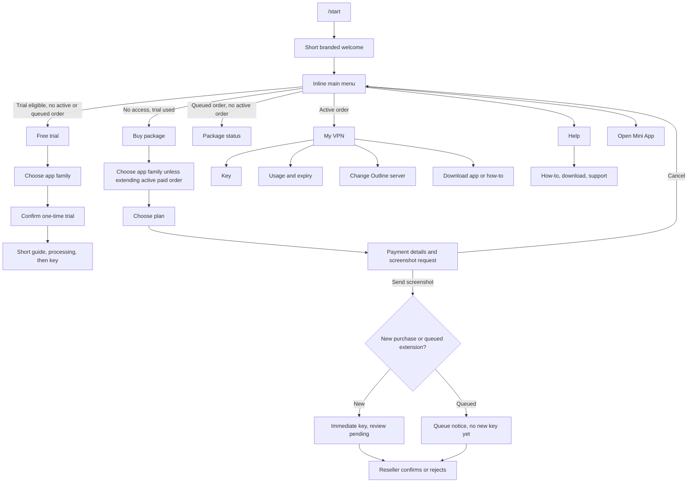

# NovaNet MM Telegram Bot: Flow and Burmese Copy Handoff

Baseline snapshot: 2026-10-04, local working tree on `feature/marzneshin`,
**before** the Burmese copy review was applied. The appendices preserve the
pre-review wording for comparison; they no longer mirror the latest local bot
copy. This does not claim the same version is deployed to production. No
customer records, bot tokens, payment accounts, or subscription links are
included in this document.

## Purpose for the Copy Editor

Review every Burmese customer-facing and reseller-facing bot message for natural,
short, clear wording. The intended audience may know the name of an app but may
not know what a protocol, subscription, server tier, or queued order means. This
is a copy/UX review, not permission to change billing, provisioning, access,
payment-review, or tenancy rules.

Please return a table with `copy ID`, `current text`, `proposed text`, and `why`.
Keep the IDs so revised wording can be applied back to code. Flag confusing
screens separately. Do not invent a new trial duration, price, data allowance,
payment method, support contact, guarantee, or activation promise. The cheapest
plan, payment account, expiry, server name, and quota are dynamic values.

Preserve Telegram HTML tags (`<b>`, `<i>`, `<code>`, `<pre>`, `<tg-emoji>`), JS
interpolation boundaries, and `{placeholder}` names exactly when proposing
copy. URLs, callback IDs, and internal protocol values are not copy. App names
such as Outline, Hiddify, Happ, V2Box, and Connect can remain in English.

## System Context

- NovaNet MM is a multi-tenant VPN reseller platform. Each reseller has a
  separate Telegram bot, brand, Mini App slug, support username, payment
  methods, and optional trial setting. Never mix reseller A's customer with
  reseller B's records.
- The bot is run by the Express backend. `/start` is the **only advertised
  slash command**. It creates or links the Telegram customer, removes the old
  persistent reply keyboard, sends a short welcome, then an inline main menu.
  Old reply-keyboard labels still work for customers who have not run `/start`
  since this local update.
- Telegram's separate chat-menu button says `Open VPN` and opens that reseller's
  Mini App. An inline `Mini App ဖွင့်မယ်` button is also on the main menu.
- The customer chooses by **app family**, not by technical protocol. Outline
  maps internally to `shadowsocks`; Hiddify/Happ/V2Box maps internally to
  `vless`. The code has some older Xray/Hysteria2 wording that the editor
  should identify, not treat as a third product offer.
- The Mini App and bot share customer, order, key, payment, and server state.
  The bot is not a separate billing system.
- A free trial is one-time per Telegram-linked customer and only if enabled
  for that reseller. A trial key uses trial capacity. Paid new provisioning
  uses premium capacity. A paid customer may manually move an Outline key to
  any eligible healthy server, including a trial-tier server; a trial customer
  cannot move to premium capacity.
- A first paid purchase gives access immediately after the screenshot is
  submitted, while the reseller reviews payment afterward. A purchase during
  an active paid package is a **queued next package**, with no new key until
  the current package ends. At most one queued purchase is allowed. That
  purchase keeps the current app/protocol in the bot flow.
- The bot's purchase session lives in Redis for 10 minutes. The screenshot is
  required to complete bot checkout. Cancelling clears this session and shows
  the inline main menu on the cancel-confirmation message.
- For Outline, the bot sends an `ssconf://` dynamic access link. For VLESS,
  it sends a subscription URL plus a QR image. The document intentionally
  contains no real customer URLs.
- Resellers can customize automated notification templates in their dashboard.
  The snapshot below contains platform **default** templates; a live reseller
  override may use different wording.

## Customer Flow



### Main menu rules

| State at `/start` or `menu:home` | First inline button | Other buttons |
|---|---|---|
| Active order | `ကျွန်ုပ်၏ VPN` | Buy unless a queued order exists, Help, Mini App |
| No active order, queued order exists | `လက်ကျန်စစ်ရန်` | Help, Mini App; no Buy |
| No active/queued order, trial enabled and unused | Trial | Buy, Help, Mini App |
| No access, trial unavailable/used | Buy | Help, Mini App |

`menu:vpn` contains Key, Balance, Server, Download, How-to, Buy (only when no
queued order), and Home. `menu:help` contains How-to, Download, optional
Support URL, and Home. The main menu text is normally `START_CTA_TEXT`;
`buy:cancel` uses `BUY_CANCELLED` as the text with the **same menu buttons**.

### Trial

1. Trial button `start:get_trial` checks account, `trial_used_at`, and the
   reseller trial setting. If blocked, it gives the account/used message and
   Home or Buy buttons.
2. Choose Outline or Hiddify/Happ/V2Box. This selects internal
   `shadowsocks` or `vless` but the customer should not need those words.
3. Confirmation asks again because trial is one-time. Back returns to app
   choice; Home returns to the main menu. Only `trial:confirm:*` provisions.
4. The bot sends an app-specific how-to, processing message, creates the
   trial order, provisions a key, then runs the normal Key display flow.
   If provisioning fails, the handler currently logs it and still tries the
   Key display, which may show no active key. Do not claim guaranteed success.

### Buy and payment

1. Buy checks whether another queued purchase already exists. If yes, it
   blocks a second queued order and shows Home.
2. A customer without an active paid order chooses the app family. When
   extending an active paid order, the bot locks to the active key's app and
   skips app choice. The plan list shows price, GB, and days dynamically.
3. The selected plan's payment message shows that reseller's configured bank
   or wallet details and requests a screenshot within 10 minutes. The inline
   buttons are Cancel and Home. Cancel clears the Redis session and shows
   the main menu immediately.
4. On a valid screenshot: upload image, create purchase/payment, clear
   session. Initial purchase sends the current key; queued extension sends
   a queue notice rather than a new key. The reseller gets the screenshot
   with Confirm/Reject buttons.
5. Reseller confirmation/rejection updates the order/payment through the
   existing lifecycle service and sends a customer DM. Separately, the
   notification job may also send a customizable payment event template.
   These are distinct copy paths and both appear in the appendices.

### Key, balance, server, guide

- Key: resolve Telegram user -> reseller-scoped customer -> best active order
  -> active key. No access shows a Buy/Home keyboard. Outline receives a
  copyable `ssconf://` link; VLESS receives QR plus copyable URL. Both have
  an app-download button and Home. Never put a real key in this document.
- Balance: shows total used GB, remaining GB or Unlimited, expiry date,
  optional queued next plan, and a Mini App/Home keyboard. No active order
  with a queued plan has a separate queued-only message.
- Server: no account or no active order gives an explanation. VLESS users
  choose nodes inside their client, so bot server switching is only for
  Outline. Outline shows all active servers, with Current/Trial/Premium
  labels. Trial -> premium is blocked; paid -> trial is permitted. The
  callback rechecks order/key/server, capacity, then switches or explains
  the block/error. Back and Home are available on the picker.
- Download: app family -> device (iOS, Android, macOS, Windows) -> app-store
  links. Back/Home buttons are provided. App URLs in the snapshot are real
  public app-store/project links, not NovaNet secrets.
- How-to: chooses the active key's app-specific guide, or the queued plan's
  app if there is no active order. If unknown, shows a generic app picker.
  When the active and queued protocols differ, an extra queued-app notice
  is appended. The user can view the other guide and return to Help/Home.

## Button and Callback Map

| Visible label or pattern | Callback / link | Meaning |
|---|---|---|
| `ကျွန်ုပ်၏ VPN` | `menu:vpn` | My VPN submenu |
| `ပင်မစာမျက်နှာ` | `menu:home` | Recompute state-dependent main menu |
| `အကူအညီ` | `menu:help` | Help submenu |
| `🛒 ပက်ကေ့ဂျ် ဝယ်ရန်` | `menu:buy` | Buy flow |
| `🔑 VPN Key ရယူရန်` | `menu:key` | Active key |
| `📊 လက်ကျန်စစ်ရန်` | `menu:balance` | Usage and expiry |
| `🌐 Server ပြောင်းရန်` | `menu:server` | Outline server picker |
| `📥 App ဒေါင်းလုပ်` | `menu:download` | App download picker |
| `📖 အသုံးပြုနည်း` | `menu:howto` | Guide |
| Trial button | `start:get_trial` | Trial eligibility and app choice |
| Outline / Hiddify-Happ-V2Box during trial | `trial:proto:ss` / `trial:proto:vless` | Confirmation screen |
| `အတည်ပြုမယ်` | `trial:confirm:shadowsocks` / `trial:confirm:vless` | One-time trial provisioning |
| Outline / Hiddify-Happ-V2Box during Buy | `buy:proto:ss` / `buy:proto:vless` | Save app family, show plans |
| Dynamic plan line | `buy:plan:{planId}` | Payment instructions |
| `မဝယ်တော့ပါ` | `buy:cancel` | Clear session, cancel text + main menu |
| Server row | `srv:sel:{serverId}` | Recheck and switch or block |
| Download picker | `dl:*` | App family, OS, link screens |
| Guide switcher | `howto:ss` / `howto:vless` | View other app guide |
| Reseller payment buttons | `pay_ok:{orderId}` / `pay_no:{orderId}` | Confirm / reject screenshot |
| `Mini App ဖွင့်မယ်` and `Open VPN` | Telegram WebApp URL | Reseller-specific Mini App |

Compatibility-only callbacks remain for older chat messages:
`start:get_key`, `key:download`, `srv:cancel`, and `trial:cancel`.
Legacy reply-keyboard text handlers remain recognized, but new `/start`
removes the persistent keyboard. `/app`, `/buy`, `/menu`, and `/help` are
**not** current bot slash commands.

## Automated Customer Notifications

Defaults are in `backend/src/bot/notificationTemplates.js`. A scheduled job
runs approximately every 10 minutes for date/payment events. The usage job
sends data warning/reached events when applicable. The actual code currently
does **not** suppress sends during quiet hours, despite an old comment near
the top of `notificationService.js`. It deduplicates by customer/event/order,
caps sends at two per customer in the last 24 hours, and respects the
reseller's `notifications_paused` switch. A failed Telegram send is not
automatically retried. Live reseller overrides come from
`reseller_notification_templates.custom_text`.

| Event ID | Trigger in current service | Default inline action |
|---|---|---|
| `trial_ending_24h` | Trial expiry is tomorrow | Package WebApp |
| `trial_expired` | Trial expired | Package WebApp + optional Support |
| `subscription_expiring_3d` | Paid expiry in 3 days | Package WebApp |
| `subscription_expired` | Paid package expired | Package WebApp + optional Support |
| `payment_confirmed` | Payment confirmed | No default action button |
| `payment_rejected` | Payment rejected | Optional Support |
| `data_limit_warning` | Usage reached 80% | Package WebApp |
| `data_limit_reached` | Usage auto-stopped the order | Package WebApp |

Notification placeholders are listed in `EVENT_META` in the verbatim
appendix. Preserve spellings such as `{plan_name}`, `{expiry_date}`,
`{price_from_mmk}`, `{remaining_gb}`, and `{reject_reason}`. The support
line is omitted from the platform default for some events when no support
username is configured; custom reseller text does not get this special
handling.

## Additional Copy Outside the Main Strings File

These user-visible literals currently live directly in `handlers.js`,
`manager.js`, or `notificationService.js`. They should be reviewed too.
Braces below denote runtime values, not literal Telegram output.

| ID / location | Current text or label | Context |
|---|---|---|
| `manager.menu_button` | `Open VPN` | Telegram chat-menu WebApp button |
| `manager.command.start` | `Start {brandName}` | Telegram `/start` command description |
| `trial.confirm` | `<b>{Outline or Hiddify / Happ / V2Box}</b> နဲ့ အခမဲ့ စမ်းသုံးမလား?\nအစမ်းသုံးခွင့် တစ်ကြိမ်သာ ရှိပါတယ်။` | Trial confirmation |
| `trial.confirm.button` | `အတည်ပြုမယ်` | Confirms trial choice |
| `server.row` | `{flag} {city} · Trial` or `{flag} {city} · Premium`; `✅` current, `🔒` locked | Server picker labels |
| `server.unavailable.toast` | `Server မရရှိနိုင်ပါ` | Missing/inactive server |
| `server.full.toast` | `Server ၏ ပြည့်သွားပြီ` | No spare capacity |
| `plan.row` | `💰 {price} MMK  \|  📊 {data} GB  \|  ⏰ {days} ရက်` | Plan picker, plan name omitted |
| `buy.cancel.button` | `မဝယ်တော့ပါ` | Plan and payment screens |
| `buy.payment.confirm.toast` | `✅ အတည်ပြုပါပြီ` | Reseller callback toast |
| `buy.payment.reject.toast` | `❌ ငြင်းပယ်ပါပြီ` | Reseller callback toast |
| `notify.buy.button` | `Package ဝယ်ရန်` | Notification Mini App WebApp button |
| `notify.support.button` | `👤 Admin / Support` | Optional support URL button |

In error callbacks, the reseller may also see `⚠️ {truncated error}`.
The app/plan/customer/server/payment placeholders are data, not copy to
translate. Customer key URLs and payment account numbers must never appear
in a copy-review artifact.

## Copy Sources, Completeness, and Editing Notes

The appendices below are **verbatim pre-review snapshots**, not replacement
source files or the latest local wording:

1. `backend/src/bot/strings.js` contains every exported static text, dynamic
   renderer, legacy label, and public download URL used by the interactive bot.
   A few exports are old/unused; check the flow and handler references before
   treating them as active screens.
2. `backend/src/bot/notificationTemplates.js` contains every platform-default
   automated customer notification and its placeholders. Actual reseller
   custom text may differ.
3. Direct inline literals from other files are catalogued in the table above.

Current copy concerns worth reviewing: mixed Burmese/English terms; old
button references in some errors; technical words such as VLESS, protocol,
subscription, Premium, Trial, queue, and active; a few overly long warnings;
and whether immediate access versus later payment review is explained
unambiguously. Preserve the distinction between first purchase and queued
extension. Do not promise a key before provisioning succeeds.

<!-- Verbatim source appendices follow. Generated from the local files on 2026-10-04. -->


## Appendix A: Bot copy (`strings.js`)

```javascript
/**
 * strings.js — All Burmese UI text for the NovaNet MM bot.
 *
 * REPLACE STUB TEXT with final Burmese copy before launch.
 * Functions accept dynamic values (brandName, etc.) and return the full string.
 * All message strings are for HTML parse_mode — use <b>, <i>, <code> tags.
 */

// Legacy reply-keyboard labels remain recognized for chats opened before the
// inline-menu release. New navigation uses callback buttons with these labels.

export const BTN = {
  KEY:      "🔑 VPN Key ရယူရန်",
  BALANCE:  "📊 လက်ကျန်စစ်ရန်",
  SERVER:   "🌐 Server ပြောင်းရန်",
  DOWNLOAD: "📥 App ဒေါင်းလုပ်",
  HOWTO:    "📖 အသုံးပြုနည်း",
};

/** One-time trial label, also recognized from older reply keyboards. */
export const BTN_TRIAL = "🎁 အစမ်းသုံး ရယူရန်";

// ── /start ─────────────────────────────────────────────────────────────────────

/**
 * Welcome message sent on /start.
 * @param {string} brandName  Reseller's brand_name from reseller_miniapps.
 */
export function startWelcome(brandName) {
  return `<b>${brandName}</b> မှ ကြိုဆိုပါတယ်။`;
}

export const START_CTA_TEXT = "ဘာလုပ်ချင်ပါသလဲ?";
export const MENU_MY_VPN = "ကျွန်ုပ်၏ VPN";
export const MENU_HELP = "အကူအညီ";
export const MENU_BACK = "နောက်သို့";
export const MENU_HOME = "ပင်မစာမျက်နှာ";
export const MENU_MY_VPN_TEXT = "<b>ကျွန်ုပ်၏ VPN</b>\nလိုချင်တာကို ရွေးပါ။";
export const MENU_HELP_TEXT = "<b>အကူအညီ</b>\nဘာကို သိချင်ပါသလဲ?";

/** Inline button labels on /start */
export const START_BTN_ADMIN        = "👤 Admin / Support";
export const START_BTN_TRIAL_KEY    = "🎁 အစမ်းသုံး ရယူရန်";
export const START_BTN_GET_KEY      = "🔑 VPN Key ရယူရန်";
export const START_BTN_BUY_PACKAGE  = "🛒 ပက်ကေ့ဂျ် ဝယ်ရန်";

/** Callback data for the /start inline buttons. */
export const START_CB_GET_KEY   = "start:get_key";
export const START_CB_GET_TRIAL = "start:get_trial";

export function appOpenText(brandName) {
  const name = brandName || "VPN";
  return `<b>${name}</b> ကို အောက်ပါခလုတ်မှ ဖွင့်ပါ။`;
}

export const APP_BTN_OPEN = "Mini App ဖွင့်မယ်";

// ── Get Key (🔑) handler ──────────────────────────────────────────────────────

/**
 * Header line shown above the key when a customer has an active key.
 * @param {string} customerName  vpn_customers.full_name
 */
export function keyFoundHeader(customerName) {
  return `🔑 ယခု <b>${customerName}</b> အကောင့်အတွက် VPN Key မှာ:`;
}

/**
 * Server line shown below the key.
 * @param {string} flag        Real flag emoji (falls back to 🌐 — see
 *                              resolveServerDisplay() in handlers.js)
 * @param {string} serverName  Real city/country name, not the raw internal
 *                              server slug — same fallback the dashboards use
 */
export function keyServerLine(flag, serverName) {
  return `🌐 Linked Server: ${flag} ${serverName}`;
}

/**
 * Copy instructions shown below the subscription URL on the key message.
 * The URL is wrapped in <code> by the caller (tap-to-copy on all Telegram clients).
 */
/** Shown under the Outline ssconf:// key */
export const KEY_COPY_INSTRUCTIONS_SS =
  "📋 URL ကို tap/copy ကူး၍ <b>Outline</b> app တွင် ထည့်ပါ။\n" +
  "   App မရှိသေးပါက 📥 <b>App ဒေါင်းလုပ်</b> ကို နှိပ်ပါ။";

/** Shown under the VLESS subscription URL + QR */
export const KEY_COPY_INSTRUCTIONS =
  "📋 QR scan (သို့) URL ကို copy ကူး၍ <b>Hiddify / Happ / V2Box</b> တွင်\n" +
  "   Subscription URL အဖြစ် ထည့်ပါ။ App မရှိသေးပါက 📥 <b>App ဒေါင်းလုပ်</b> ကို နှိပ်ပါ။";

/** Inline button label — opens the app download picker */
export const KEY_BTN_DOWNLOAD = "📥 App ဒေါင်းလုပ်";

/** Shown when the customer has no active order or no provisioned key */
export const KEY_NO_ACTIVE =
  "လက်ရှိ အသုံးပြုနိုင်သော VPN Key မရှိပါ။\nအောက်ပါခလုတ်မှ package ဝယ်နိုင်ပါတယ်။";

/** Generic error shown when the DB/network lookup fails */
export const KEY_ERROR =
  "⚠️ Key ရယူရာတွင် အမှားဖြစ်သွားသည်။ ခဏကြာပြီးနောက် ထပ်ကြိုးစားပါ။";

// ── Check Balance (📊) handler ─────────────────────────────────────────────────

export const BALANCE_TEXT =
  "📊 <b>လက်ကျန် GB စစ်ဆေးရန်:</b>\n\n" +
  "လက်ကျန် data နှင့် သက်တမ်း အချက်အလက်များကို VPN app တွင် ကြည့်ရှုနိုင်ပါသည်။\n\n" +
  "အောက်ပါ <b>Open VPN</b> ကို နှိပ်ပါ 👇";

/**
 * Balance text with real usage numbers — shown when the customer has an
 * active order with a resolvable quota snapshot (buildOrderQuotaSnapshot()).
 * Falls back to the generic BALANCE_TEXT above when there's no active order.
 *
 * @param {object} params
 * @param {number} params.usedGb          total lifetime usage across all keys on this order
 * @param {number|null} params.remainingGb  null when unlimited or no data limit set
 * @param {boolean} params.isUnlimited
 * @param {string|null} params.expiryDate  vpn_orders.expiry_date (YYYY-MM-DD)
 */
export function balanceText({
  usedGb,
  remainingGb,
  isUnlimited,
  expiryDate,
  formatBurmeseDate,
  queuedPlan = null,
}) {
  const remainingLine = isUnlimited
    ? "🔓 အကန့်အသတ်မရှိ (Unlimited)"
    : remainingGb != null
      ? `${remainingGb} GB`
      : "-";

  let queuedSection = "";
  if (queuedPlan) {
    const qData = queuedPlan.dataLimitGb ? `${queuedPlan.dataLimitGb} GB` : "Unlimited";
    const qDays = queuedPlan.durationDays ? `${queuedPlan.durationDays} ရက်` : "";
    queuedSection =
      "\n\n⏳ <b>တန်းစီထားသော ပက်ကေ့ချ် (Next in Queue):</b>\n" +
      `📦 <b>${queuedPlan.planName}</b>\n` +
      `📊 Data: <b>${qData}</b>  |  ⏰ သက်တမ်း: <b>${qDays}</b>\n` +
      "ℹ️ <i>လက်ရှိ ပက်ကေ့ချ် သက်တမ်းကုန်လျှင် (သို့) data ကုန်လျှင် အလိုအလျောက် စတင်ပါမည်။</i>";
  }

  const expiryLine = expiryDate ? `\n📅 သက်တမ်းကုန်ရက်: ${formatBurmeseDate(expiryDate)}` : "";

  return (
    "📊 <b>လက်ကျန် GB စစ်ဆေးရန်:</b>\n\n" +
    `📈 အသုံးပြုပြီး: <b>${usedGb} GB</b>\n` +
    `📉 လက်ကျန်: <b>${remainingLine}</b>` +
    expiryLine +
    queuedSection +
    "\n\nအသေးစိတ်ကို VPN app တွင် ဆက်လက်ကြည့်ရှုနိုင်ပါသည်။ အောက်ပါ <b>Open VPN</b> ကို နှိပ်ပါ 👇"
  );
}

/**
 * Shown when the customer has no active order but has a queued package waiting.
 * @param {object} params
 * @param {object} params.queuedPlan
 */
export function balanceQueuedOnlyText({ queuedPlan }) {
  const qData = queuedPlan.dataLimitGb ? `${queuedPlan.dataLimitGb} GB` : "Unlimited";
  const qDays = queuedPlan.durationDays ? `${queuedPlan.durationDays} ရက်` : "";
  return (
    "📊 <b>လက်ကျန် အချက်အလက်:</b>\n\n" +
    "❌ လက်ရှိ active package မရှိသေးပါ။\n\n" +
    "⏳ <b>တန်းစီထားသော ပက်ကေ့ချ် (Next in Queue):</b>\n" +
    `📦 <b>${queuedPlan.planName}</b>\n` +
    `📊 Data: <b>${qData}</b>  |  ⏰ သက်တမ်း: <b>${qDays}</b>\n\n` +
    "အသေးစိတ်ကို VPN app တွင် ဆက်လက်ကြည့်ရှုနိုင်ပါသည်။ အောက်ပါ <b>Open VPN</b> ကို နှိပ်ပါ 👇"
  );
}

export const BALANCE_BTN_OPEN = "📊 Open VPN";

// ── Change Server (🌐) handler ─────────────────────────────────────────────────

export const SERVER_BTN_OPEN = "🌐 Change Server";

/** Shown when the customer has never done /start. */
export const SERVER_NO_ACCOUNT =
  "⚠️ အကောင့် မရှိပါ။ /start ကို ဦးစွာ နှိပ်ပါ။";

/** Shown when the customer has no active order. */
export const SERVER_NO_ACTIVE =
  "Server ပြောင်းရန် လက်ရှိအသုံးပြုနိုင်သော package လိုပါတယ်။";

/** Shown when a PREMIUM customer's active key uses VLESS — subscription covers all nodes. */
export const SERVER_VLESS_EXPLAIN =
  "🌐 <b>VLESS Subscription</b>\n\n" +
  "သင့် VLESS subscription သည် <b>server အားလုံးကို အလိုအလျောက် ပေါင်းစပ်</b>ပေးသည်။\n\n" +
  "Hiddify / Xray app က <b>အကောင်းဆုံး server</b> ကို အလိုအလျောက် ရွေးချယ်ပေးမည်ဖြစ်သောကြောင့် " +
  "manual switch လုပ်ရန် မလိုပါ။\n\n" +
  "Server ကို manual ပြောင်းလိုပါက app ထဲ၌ node list မှ ပြောင်းနိုင်ပါသည်";

/** Shown when a TRIAL customer's active key uses VLESS — trial node only. */
export const SERVER_VLESS_TRIAL =
  "⚡ <b>VLESS Trial · Trial Server သာ</b>\n\n" +
  "Trial VLESS key သည် <b>Trial server တစ်ခုသာ</b> ချိတ်ဆက်နိုင်သည်။\n\n" +
  "🔓 <b>Server အားလုံးသို့ ချိတ်ဆက်ရန်</b> Premium package ဝယ်ယူပါ —\n" +
  "Premium VLESS subscription ဖြင့် မြန်နှုန်းမြင့် server များ အားလုံးကို Hiddify / Xray app " +
  "ထဲတွင် တစ်ချက်နှိပ်၍ ရွေးချယ်နိုင်မည်ဖြစ်သည်။";

/**
 * Header for the server picker inline keyboard.
 * @param {boolean} isTrial  True when the customer is on a trial order.
 */
export function serverChooseText(isTrial) {
  const trialNote = isTrial
    ? "\n\n🔒 Premium server များသည် paid package လိုအပ်သည်။ ဝယ်ယူပါက ဤ server များကို ရရှိနိုင်သည်။"
    : "";
  return (
    "🌐 <b>Server ရွေးချယ်ပါ</b>\n\n" +
    "ချိတ်ဆက်လိုသော server ကို နှိပ်ပါ 👇" +
    trialNote
  );
}

/** Shown while the bot performs the server switch. */
export const SERVER_SWITCHING =
  "⏳ Server ပြောင်းနေသည်... ခဏစောင့်ပါ 🙏";

/**
 * Shown on successful server switch.
 * @param {string} flag   Flag emoji for the new server.
 * @param {string} name   Display name for the new server.
 */
export function serverSwitchSuccess(flag, name) {
  return (
    `✅ <b>${flag} ${name}</b> သို့ ပြောင်းပြီးပါပြီ!\n\n` +
    "🔑 <b>VPN Key ရယူရန်</b> ကို နှိပ်ပါ"
  );
}

/** Shown when a trial customer taps a premium server. */
export const SERVER_TRIAL_LOCKED =
  "🔒 <b>Premium Server — paid package လိုအပ်သည်</b>\n\n" +
  "Trial package သည် Trial server သာ သုံးနိုင်သည်။\n" +
  "Premium server များ ရရှိရန် 🛒 <b>ပက်ကေ့ဂျ် ဝယ်ရန်</b> ကို နှိပ်ပါ။";

/** Shown when the customer taps the server they are already connected to. */
export const SERVER_ALREADY_LINKED =
  "✅ ဤ server နှင့် ချိတ်ဆက်ပြီးဖြစ်သည်";

/** Shown when the customer has no provisioned key yet. */
export const SERVER_NO_KEY =
  "⚠️ VPN Key မရှိသေးပါ။\n\n" +
  "🔑 <b>VPN Key ရယူရန်</b> ကို ဦးစွာနှိပ်ပြီး key ရယူပါ၊ ထို့နောက် server ပြောင်းနိုင်ပါသည်။";

/** Generic error during the server switch. */
export const SERVER_SWITCH_ERROR =
  "⚠️ Server ပြောင်းရာတွင် အမှားဖြစ်သွားသည်။ ခဏကြာပြီးနောက် ထပ်ကြိုးစားပါ။";

// ── Download App (📥) — 3-level flow ──────────────────────────────────────────
// Level 1: Protocol picker  (SS  or  VLESS/Xray)
// Level 2: OS picker        (iOS / Android / macOS / Windows)
// Level 3: App links        (one per app, URL buttons)

export const DL_CB = {
  // Level 1
  PROTO:   "dl:proto",
  SS:      "dl:ss",
  VLESS:   "dl:vl",
  // Level 2 — Outline
  SS_IOS:  "dl:ss:ios",
  SS_AND:  "dl:ss:and",
  SS_MAC:  "dl:ss:mac",
  SS_WIN:  "dl:ss:win",
  // Level 2 — VLESS / Xray
  VL_IOS:  "dl:vl:ios",
  VL_AND:  "dl:vl:and",
  VL_MAC:  "dl:vl:mac",
  VL_WIN:  "dl:vl:win",
};

/** Level 1 — protocol picker */
export const DOWNLOAD_PICKER_TEXT =
  "<b>App ဒေါင်းလုဒ်</b>\n\nဘယ် App ကို သုံးမလဲ?";

export const DL_PROTO_BTNS = {
  SS:    "📱 Outline",
  VLESS: "Hiddify / Happ / V2Box",
};

/** Level 2 — OS picker labels (shared for both SS and VLESS) */
export const DL_OS_BTNS = {
  IOS:     "🍎 iPhone / iPad",
  ANDROID: "🤖 Android",
  MACOS:   "💻 macOS",
  WINDOWS: "🪟 Windows",
  BACK:    "⬅️ ပြန်သွားရန်",
};

// ── Custom emoji IDs (VPNPack6 — t.me/addemoji/VPNPack6) ─────────────────────
const EMO = {
  HIDDIFY:  `<tg-emoji emoji-id="6118150126826431713">🌐</tg-emoji>`,
  OUTLINE:  `<tg-emoji emoji-id="6118251264716317433">📱</tg-emoji>`,
  V2RAYTUN: `<tg-emoji emoji-id="6120927368644140757">📱</tg-emoji>`,
  V2RAYNG:  `<tg-emoji emoji-id="6118303491518635890">📱</tg-emoji>`,
  V2BOX:    `<tg-emoji emoji-id="6120480571786272759">📦</tg-emoji>`,
};

export const DL_SS_TEXT =
  `${EMO.OUTLINE} <b>Outline — Platform ရွေးချယ်ပါ</b>\n\n` +
  "<b>Outline</b> app သည် Outline key ကို တိုက်ရိုက် ထည့်သွင်းနိုင်သည်။\n" +
  "Device ကို ရွေးချယ်ပါ 👇";

export const DL_VLESS_TEXT =
  `${EMO.HIDDIFY} <b>Hiddify / Happ / V2Box</b>\n\nသုံးမည့်စက်ကို ရွေးပါ။`;

// Level 3 — Outline: Outline only, per OS
export const DL_SS_PLATFORMS = {
  ios: {
    text:
      `🍎 <b>iPhone / iPad — Outline</b>\n\n` +
      `${EMO.OUTLINE} <b>Outline</b> — App Store မှ download ဆွဲပြီး\n` +
      "VPN key ကို app ထဲ ထည့်သွင်းပါ 👇",
    apps: [
      { label: "📲 Outline — App Store", url: "https://apps.apple.com/app/id1356177741" },
    ],
  },
  android: {
    text:
      `🤖 <b>Android — Outline</b>\n\n` +
      `${EMO.OUTLINE} <b>Outline</b> — Google Play မှ download ဆွဲပြီး\n` +
      "VPN key ကို app ထဲ ထည့်သွင်းပါ 👇",
    apps: [
      { label: "📲 Outline — Google Play", url: "https://play.google.com/store/apps/details?id=org.outline.android.client" },
    ],
  },
  macos: {
    text:
      `💻 <b>macOS — Outline</b>\n\n` +
      `${EMO.OUTLINE} <b>Outline</b> — Mac App Store မှ download ဆွဲပြီး\n` +
      "VPN key ကို app ထဲ ထည့်သွင်းပါ 👇",
    apps: [
      { label: "📲 Outline — Mac App Store", url: "https://apps.apple.com/app/id1356177741" },
    ],
  },
  windows: {
    text:
      `🪟 <b>Windows — Outline</b>\n\n` +
      `${EMO.OUTLINE} <b>Outline</b> — download ဆွဲပြီး install လုပ်ကာ\n` +
      "VPN key ကို app ထဲ ထည့်သွင်းပါ 👇",
    apps: [
      { label: "📲 Outline — Windows", url: "https://getoutline.org/get-started/#step-3" },
    ],
  },
};

// Level 3 — VLESS / Xray: Xray-core clients per OS
export const DL_VLESS_PLATFORMS = {
  ios: {
    text:
      "🍎 <b>iPhone / iPad</b>\n\nApp ကို ရွေးပြီး VPN လင့်ခ် ထည့်ပါ။",
    apps: [
      { label: "📲 Hiddify",  url: "https://apps.apple.com/app/id6596777532" },
      { label: "📲 Happ",     url: "https://apps.apple.com/app/id6504287215" },
      { label: "📲 V2Box",    url: "https://apps.apple.com/app/id6446814690" },
      { label: "📲 V2rayTun", url: "https://apps.apple.com/app/id6476628951" },
    ],
  },
  android: {
    text:
      "🤖 <b>Android</b>\n\nApp ကို ရွေးပြီး VPN လင့်ခ် ထည့်ပါ။",
    apps: [
      { label: "📲 Hiddify",  url: "https://play.google.com/store/apps/details?id=app.hiddify.com" },
      { label: "📲 Happ",     url: "https://play.google.com/store/apps/details?id=com.happproxy" },
      { label: "📲 V2rayNG",  url: "https://play.google.com/store/apps/details?id=com.v2ray.ang" },
    ],
  },
  macos: {
    text:
      "💻 <b>macOS</b>\n\nApp ကို ရွေးပြီး VPN လင့်ခ် ထည့်ပါ။",
    apps: [
      { label: "📲 Hiddify", url: "https://apps.apple.com/app/id6596777532" },
      { label: "📲 Happ",    url: "https://apps.apple.com/app/id6504287215" },
      { label: "📲 V2Box",   url: "https://apps.apple.com/app/id6446814690" },
    ],
  },
  windows: {
    text:
      "🪟 <b>Windows</b>\n\nApp ကို ဒေါင်းလုဒ်လုပ်ပြီး VPN လင့်ခ် ထည့်ပါ။",
    apps: [
      { label: "📲 Hiddify — Windows", url: "https://github.com/hiddify/hiddify-app/releases/latest" },
    ],
  },
};

// ── Buy Package (🛒) flow ─────────────────────────────────────────────────────

/** Buy label, also recognized from older reply keyboards. */
export const BTN_BUY = "🛒 ပက်ကေ့ဂျ် ဝယ်ရန်";

/** First step: ask customer which protocol they want. */
export const BUY_SELECT_PROTOCOL =
  "<b>Package ဝယ်ရန်</b>\n\nဘယ် App နဲ့ သုံးမလဲ?";

export const BUY_PROTO_SS_BTN   = "📱 Outline";
export const BUY_PROTO_VLESS_BTN = "Hiddify / Happ / V2Box";

/** Prompt shown with the plan selection inline keyboard. */
export const BUY_SELECT_PLAN =
  "🛒 <b>ပက်ကေ့ဂျ် ရွေးချယ်ပါ</b>\n\n" +
  "အောက်ပါ package များမှ သင်နှစ်သက်ရာတစ်ခုကို ရွေးချယ်ပေးပါ 👇";

/** Shown when the plan list is empty or can't be loaded. */
export const BUY_NO_PLANS =
  "⚠️ ယခုအချိန်တွင် ဝယ်ယူ၍ရသော package မရှိပါ။\n" +
  "ခဏကြာပြီးနောက် ထပ်ကြိုးစားပါ သို့မဟုတ် Admin ကို ဆက်သွယ်ပါ။";

/**
 * Payment instructions sent after the customer picks a plan.
 * @param {object} plan  { name, price_mmk, data_limit_gb, duration_days }
 * @param {object} paymentInfo  { method, account, name } from reseller_miniapps
 */
export function buyPaymentInstructions(plan, paymentMethods) {
  const methodLines = (paymentMethods || [])
    .map((m) => `   • <b>${m.method}</b>: ${m.account_number}${m.account_name ? ` (${m.account_name})` : ""}`)
    .join("\n");

  return [
    `📦 <b>${plan.name}</b>`,
    `💰 ${plan.price_mmk.toLocaleString()} MMK`,
    `📊 ${plan.data_limit_gb} GB  |  ⏰ ${plan.duration_days} ရက်`,
    "",
    "💳 <b>ငွေပေးချေနည်း</b>",
    methodLines || "   ➡️ Admin ကို တိုက်ရိုက် ဆက်သွယ်ပါ",
    "",
    "📸 ငွေလွှဲပြီးပါက <b>ငွေပေးချေမှု screenshot</b> ကို ဤ chat တွင် ပေးပို့ပါ 👇",
    "",
    "⏱ <i>မိနစ် ၁၀ အတွင်း screenshot မပေးပို့ပါက အော်ဒါ ဆက်မလုပ်ဆောင်ပဲ ဖျက်သွားမည်ဖြစ်သည်။</i>",
  ].join("\n");
}

/** Shown while the bot processes the screenshot (downloading + provisioning). */
export const BUY_PROCESSING =
  "⏳ စစ်ဆေးနေပါသည်... ခဏစောင့်ပါ 🙏";

/**
 * Success message sent to the customer after the key is provisioned.
 * @param {string} planName
 * @param {string} dynamicUrl   subscription URL for the key
 * @param {string} expiryDate   YYYY-MM-DD
 */
export function buySuccessText(planName, dynamicUrl, expiryDate, formatBurmeseDate) {
  return [
    `✅ <b>${planName}</b> ပက်ကေ့ဂျ် စတင်ပါပြီ!`,
    "",
    "🔑 သင်၏ VPN Key (Subscription URL):",
    `<pre>${dynamicUrl}</pre>`,
    "",
    "အထက်ပါ URL ကို copy ကူး၍ <b>Hiddify</b> app တွင် ထည့်သွင်းပါ။",
    "",
    `📅 သက်တမ်းကုန်ရက်: ${expiryDate ? formatBurmeseDate(expiryDate) : "—"}`,
    "",
    "⚠️ ငွေပေးချေမှုကို Reseller မှ စစ်ဆေးနေပါသည်။ မမှန်ကန်ပါက ဝန်ဆောင်မှု ရပ်နားမည်ဖြစ်သည်။",
  ].join("\n");
}

/** Shown when the customer already has an active purchase order and a queued order. */
export const BUY_ALREADY_QUEUED =
  "ℹ️ သင့်တွင် လက်ရှိ package အပြင် စောင့်ဆိုင်းနေသော (Queue) package တစ်ခု ရှိနေပြီးဖြစ်သည်။\n\n" +
  "လက်ရှိ package သို့မဟုတ် စောင့်ဆိုင်းနေသော package သက်တမ်းကုန်ဆုံးပြီးမှသာ ထပ်မံဝယ်ယူနိုင်ပါမည်။\n" +
  "📊 အသေးစိတ်ကြည့်ရန် — <b>📊 လက်ကျန်စစ်ရန်</b> ကို နှိပ်ပါ။";

/** Shown when the customer already has an active purchase order. */
export const BUY_ALREADY_ACTIVE =
  "ℹ️ သင့်တွင် လက်ရှိ active package ရှိနေပြီဖြစ်သည်။\n\n" +
  "Package သက်တမ်းကုန်မှ ဝယ်ယူ၍ ရပါမည်။\n" +
  "📊 လက်ကျန် GB စစ်ဆေးရန် — <b>📊 လက်ကျန်စစ်ရန်</b> ကို နှိပ်ပါ။";

/** Shown when customer purchases an extension/queued plan. */
export function buyExtendSuccessText(planName, durationDays, dataLimitGb) {
  return [
    `✅ <b>${planName}</b> ပက်ကေ့ဂျ်ကို Queue ထဲသို့ ထည့်သွင်းပြီးပါပြီ!`,
    "",
    `📊 Data: <b>${dataLimitGb} GB</b>  |  ⏰ သက်တမ်း: <b>${durationDays} ရက်</b>`,
    "",
    "ℹ️ ဤပက်ကေ့ဂျ်သည် သင်၏ လက်ရှိ Package သက်တမ်းကုန်ဆုံးပါက (သို့မဟုတ်) Data ကုန်သွားပါက အလိုအလျောက် စတင်အသုံးပြုနိုင်မည်ဖြစ်ပါသည်။",
    "",
    "⚠️ ငွေပေးချေမှုကို Reseller မှ စစ်ဆေးနေပါသည်။",
  ].join("\n");
}

/** Shown when the customer cancels the buy flow. */
export const BUY_CANCELLED =
  "❌ ပက်ကေ့ဂျ် ဝယ်ယူမှု ဖျက်သိမ်းပါပြီ။\n" +
  "ပြန်လည် ဝယ်ယူလိုပါက 🛒 ကိုနှိပ်ပါ။";

/** Generic error during purchase. */
export const BUY_ERROR =
  "⚠️ ဝယ်ယူမှုတွင် အမှားဖြစ်သွားသည်။ ထပ်ကြိုးစားပါ သို့မဟုတ် Admin ကို ဆက်သွယ်ပါ။";

/** Shown when customer sends a photo but there's no active buy session. */
export const BUY_NO_SESSION =
  "📸 Screenshot ရရှိပါပြီ — သို့သော် ဝယ်ယူမှု session မရှိပါ။\n" +
  "ဝယ်ယူရန် 🛒 <b>ပက်ကေ့ဂျ် ဝယ်ရန်</b> ကိုနှိပ်ပြီး package ရွေးပါ။";

// ── Reseller notification strings ─────────────────────────────────────────────

/**
 * Caption for the photo notification sent to the reseller.
 * @param {object} p  { customerName, planName, priceMmk, durationDays, dataLimitGb, orderId, isExtend }
 */
export function resellerNotifyCaption({ customerName, planName, priceMmk, durationDays, dataLimitGb, orderId, isExtend = false }) {
  const header = isExtend
    ? "💰 <b>ငွေပေးချေမှု ရောက်ရှိလာပါပြီ [သက်တမ်းတိုး / Queue ပက်ကေ့ချ်]</b>"
    : "💰 <b>ငွေပေးချေမှု ရောက်ရှိလာပါပြီ</b>";
  return [
    header,
    "",
    `👤 Customer: <b>${customerName}</b>`,
    `📦 Package: <b>${planName}</b>${isExtend ? " (Queue Plan)" : ""}`,
    `💵 ${priceMmk.toLocaleString()} MMK  |  📊 ${dataLimitGb} GB  |  ⏰ ${durationDays} ရက်`,
    "",
    `🆔 Order: <code>${orderId}</code>`,
    "",
    "✅ မှန်ကန်ပါက <b>အတည်ပြုမည်</b> ကို နှိပ်ပါ\n❌ မမှန်ကန်ပါက <b>ငြင်းပယ်မည်</b> ကို နှိပ်ပါ",
  ].join("\n");
}

/** Inline button labels for the reseller notification. */
export const NOTIFY_CONFIRM_BTN = "✅ အတည်ပြုမည်";
export const NOTIFY_REJECT_BTN  = "❌ ငြင်းပယ်မည်";

/** Caption suffix appended when the reseller takes action. */
export const NOTIFY_CONFIRMED = "\n\n✅ <b>ငွေပေးချေမှု အတည်ပြုပြီး</b>";
export const NOTIFY_REJECTED  = "\n\n❌ <b>ငြင်းပယ်ပြီး — ဝန်ဆောင်မှု ရပ်နားသွားမည်</b>";

/** DM sent to the customer after the reseller confirms. */
export const CUSTOMER_PAYMENT_CONFIRMED =
  "✅ <b>ငွေပေးချေမှု အတည်ပြုပါပြီ</b> 🎉\n\n" +
  "🔑 VPN Key ရယူရန် — <b>🔑 VPN Key ရယူရန်</b> ကို နှိပ်ပါ";

/** DM sent to the customer after the reseller rejects. */
export const CUSTOMER_PAYMENT_REJECTED =
  "❌ <b>ငွေပေးချေမှု အတည်မပြုနိုင်ပါ</b>\n\n" +
  "ငွေပေးချေမှု မမှန်ကန်သောကြောင့် ဝန်ဆောင်မှု ရပ်နားသွားပါပြီ။\n\n" +
  "အသေးစိတ် မေးမြန်းရန် Admin ကို ဆက်သွယ်ပါ 👇";

// ── Trial Key (🎁) flow ───────────────────────────────────────────────────────

/** Protocol picker shown when customer taps BTN_TRIAL. */
export const TRIAL_SELECT_PROTOCOL =
  "<b>အခမဲ့ စမ်းသုံးမယ်</b>\n\nဘယ် App နဲ့ သုံးမလဲ?";

/** Shown while creating the trial order + provisioning the key. */
export const TRIAL_PROCESSING =
  "⏳ Trial Key ဖန်တီးနေသည်... ခဏစောင့်ပါ 🙏";

/** Shown when the customer has already used their one-time trial. */
export const TRIAL_ALREADY_USED =
  "အစမ်းသုံးခွင့်ကို ရယူပြီးပါပြီ။ Package ဝယ်ပြီး ဆက်သုံးနိုင်ပါတယ်။";

/** Shown when customer taps trial button but has never done /start. */
export const TRIAL_NO_ACCOUNT =
  "⚠️ အကောင့် မရှိပါ။ /start ကို ဦးစွာ နှိပ်ပါ။";

/** Generic error during trial creation/provisioning. */
export const TRIAL_ERROR =
  "⚠️ Trial Key ဖန်တီးရာတွင် အမှားဖြစ်သွားသည်။\n" +
  "ခဏကြာပြီးနောက် ထပ်ကြိုးစားပါ သို့မဟုတ် Admin ကို ဆက်သွယ်ပါ။";

// ── VLESS key display ─────────────────────────────────────────────────────────

/**
 * Instructions shown alongside the VLESS QR code image.
 * The URL is also included in the caption as <code> for tap-to-copy.
 */

// ── How to Use (📖) handler ────────────────────────────────────────────────────

/**
 * Static Burmese how-to instructions.
 * @param {string} supportUsername  reseller_miniapps.support_username (no @), or "".
 */
export const HOWTO_BTN_SS = "📱 Outline အသုံးပြုနည်း";
export const HOWTO_BTN_VLESS = "Hiddify / Happ / V2Box အသုံးပြုနည်း";

export const HOWTO_CB = {
  SS: "howto:ss",
  VLESS: "howto:vless",
};

/**
 * Notice appended when active protocol differs from queued protocol.
 * @param {"shadowsocks"|"vless"} queuedProtocol
 */
export function howtoQueuedNotice(queuedProtocol) {
  const isQueuedSs = queuedProtocol === "shadowsocks";
  const appName = isQueuedSs ? "Outline" : "Hiddify / Happ / V2Box";
  return (
    "<b>နောက်အသုံးပြုမည့် package</b>\n" +
    `လက်ရှိ package ကုန်သွားလျှင် <b>${appName}</b> နဲ့ သုံးပါ။`
  );
}

/** How-to for Outline customers (Outline app). */
export function howToUseSS(queuedNotice = "") {
  return [
    "<b>Outline အသုံးပြုနည်း</b>",
    "",
    "1. Outline ကို ဒေါင်းလုဒ်လုပ်ပါ။",
    "2. ကျွန်ုပ်၏ VPN မှ Key ကို ရယူပါ။",
    "3. Key ကို Outline ထဲ ထည့်ပါ။",
    "4. Connect နှိပ်ပါ။",
    ...(queuedNotice ? ["", queuedNotice] : []),
  ].join("\n");
}

/** How-to for VLESS customers (Hiddify / Xray-core clients). */
export function howToUseVless(queuedNotice = "") {
  return [
    "<b>Hiddify / Happ / V2Box အသုံးပြုနည်း</b>",
    "",
    "1. သုံးမည့် App ကို ဒေါင်းလုဒ်လုပ်ပါ။",
    "2. ကျွန်ုပ်၏ VPN မှ Key ကို ရယူပါ။",
    "3. လင့်ခ်ကို App ထဲ ထည့်ပါ (သို့) QR ဖတ်ပါ။",
    "4. Server ရွေးပြီး Connect နှိပ်ပါ။",
    ...(queuedNotice ? ["", queuedNotice] : []),
  ].join("\n");
}

/** Full guide shown when the customer's protocol is unknown. */
export function howToUse() {
  return [
    "<b>VPN အသုံးပြုနည်း</b>",
    "",
    "သုံးမည့် App ကို ရွေးပြီး အသုံးပြုနည်းကို ကြည့်ပါ။",
  ].join("\n");
}
```

## Appendix B: Default notifications (`notificationTemplates.js`)

```javascript
// Burmese customer-notification templates.
//
// Every template is rendered with HTML parse_mode. Templates are plain
// strings with {placeholder} tokens — this is the SAME format resellers see
// and edit in the dashboard (reseller-dashboard NotificationsPage), so
// DEFAULT_TEMPLATES below is the single source of truth for both the
// platform default and the "what does {plan_name} mean" reference shown to
// resellers.
//
// If a reseller has no support_username set, the "Admin/Support" line is
// omitted entirely rather than rendering a dangling "@" or a generic
// fallback (per user 1A decision, 2026-08-14). This only applies to the two
// events whose default template includes an optional support line
// (trial_expired, subscription_expired, payment_rejected) — see
// OPTIONAL_SUPPORT_LINE_EVENTS below. Reseller-customized text does not get
// this conditional-line behavior; if a reseller writes {support_username}
// into their custom text with no username configured, it renders empty.

const BURMESE_DIGITS = ["၀","၁","၂","၃","၄","၅","၆","၇","၈","၉"];
const BURMESE_MONTHS = [
  "ဇန်နဝါရီ", "ဖေဖော်ဝါရီ", "မတ်", "ဧပြီ", "မေ", "ဇွန်",
  "ဇူလိုင်", "ဩဂုတ်", "စက်တင်ဘာ", "အောက်တိုဘာ", "နိုဝင်ဘာ", "ဒီဇင်ဘာ",
];

function toBurmeseNumber(n) {
  return String(n)
    .split("")
    .map((c) => (c >= "0" && c <= "9" ? BURMESE_DIGITS[Number(c)] : c))
    .join("");
}

/**
 * Format a `expiry_date` (YYYY-MM-DD or Date) in Myanmar-local, Burmese style.
 *   e.g. "၂၀၂၆ ခုနှစ်၊ ဩဂုတ်လ ၁၅ ရက်"
 *
 * The `expiry_date` column is a plain DATE (no timezone), so we treat the
 * calendar date as-is — no conversion needed. Per user 2A decision:
 * customers see the date they expect.
 */
export function formatBurmeseDate(value) {
  if (!value) return "";
  const s = String(value).slice(0, 10);
  const [y, m, d] = s.split("-").map(Number);
  if (!y || !m || !d) return s;
  return `${toBurmeseNumber(y)} ခုနှစ်၊ ${BURMESE_MONTHS[m - 1]}လ ${toBurmeseNumber(d)} ရက်`;
}

// ── Event catalog ────────────────────────────────────────────────────────────

export const NOTIFICATION_EVENT_TYPES = [
  "trial_ending_24h",
  "trial_expired",
  "subscription_expiring_3d",
  "subscription_expired",
  "payment_confirmed",
  "payment_rejected",
  "data_limit_reached",
  "data_limit_warning",
];

// Human labels + which placeholders each event's data object provides. Used
// by both the reseller-dashboard UI (to show a legend / validate saves) and
// as documentation for anyone editing this file.
export const EVENT_META = {
  trial_ending_24h: {
    label: "Trial ကုန်ဆုံးရန် ၂၄ နာရီ ကျန်",
    description: "Trial package expires in exactly 1 day.",
    // deep_link_url isn't in the default text — it drives the "Package
    // ဝယ်ရန်" inline button instead (see DEEP_LINK_BUTTON_EVENTS in
    // notificationService.js). Still listed here since it's available data.
    placeholders: ["brand_name", "expiry_date", "price_from_mmk", "deep_link_url"],
  },
  trial_expired: {
    label: "Trial ကုန်ဆုံးပြီး",
    description: "Trial package expired today.",
    // deep_link_url drives the "Package ဝယ်ရန်" inline button, not raw text
    // in the body — see DEEP_LINK_BUTTON_EVENTS in notificationService.js.
    placeholders: ["brand_name", "price_from_mmk", "deep_link_url", "support_username"],
  },
  subscription_expiring_3d: {
    label: "Package ကုန်ဆုံးရန် ၃ ရက် ကျန်",
    description: "Paid subscription expires in 3 days.",
    // deep_link_url drives the "Package ဝယ်ရန်" inline button, not raw text
    // in the body — see DEEP_LINK_BUTTON_EVENTS in notificationService.js.
    placeholders: ["brand_name", "plan_name", "expiry_date", "deep_link_url"],
  },
  subscription_expired: {
    label: "Package ကုန်ဆုံးပြီး",
    description: "Paid subscription expired today.",
    placeholders: ["brand_name", "plan_name", "deep_link_url", "support_username"],
  },
  payment_confirmed: {
    label: "ငွေပေးချေမှု အတည်ပြုပြီး",
    description: "order_payments.review_status flipped to confirmed.",
    placeholders: ["brand_name", "plan_name", "expiry_date"],
  },
  payment_rejected: {
    label: "ငွေပေးချေမှု လက်မခံ",
    description: "order_payments.review_status flipped to rejected.",
    placeholders: ["brand_name", "plan_name", "reject_reason", "support_username"],
  },
  data_limit_reached: {
    label: "Data limit ကုန်ဆုံးပြီး",
    description:
      "Fires the moment syncUsageJob auto-stops an order for exceeding its plan's " +
      "data limit — trial or paid, whichever hits first. Independent of the " +
      "date-based trial_expired/subscription_expired events, which wouldn't " +
      "fire until the order's original calendar expiry date even though " +
      "access was already cut off earlier for running out of data.",
    placeholders: ["brand_name", "plan_name", "deep_link_url"],
  },
  data_limit_warning: {
    label: "Data limit ကုန်ခါနီးပြီ (80%)",
    description:
      "Advance warning at 80% of the plan's data limit, checked on the same " +
      "hourly syncUsageJob tick as data_limit_reached — the data-limit side's " +
      "equivalent of trial_ending_24h / subscription_expiring_3d, so customers " +
      "get a heads-up before hitting a hard cutoff either way (by date or by " +
      "data), not just for the date-based one.",
    placeholders: ["brand_name", "plan_name", "percent_used", "remaining_gb", "deep_link_url"],
  },
};

// ── Default templates (placeholder-string format) ───────────────────────────
// {support_username} lines are handled specially in renderDefault() below —
// they're omitted entirely when support_username is empty, rather than
// leaving a dangling "@" (see file header). Custom reseller text does not
// get this treatment; it's a straight token substitution.

export const DEFAULT_TEMPLATES = {
  // No raw {deep_link_url} in the body — it's attached as a "Package ဝယ်ရန်"
  // inline WebApp button instead (see DEEP_LINK_BUTTON_EVENTS in
  // notificationService.js). The {price_from_mmk} placeholder is populated
  // per-reseller from their cheapest active plan.
  trial_ending_24h: [
    "<b>⏰ trial ending soon!</b>",
    "",
    "သင့် အစမ်းသုံးပက်ကေ့ချ်သည် နောက် ၂၄ နာရီ အတွင်း ကုန်ဆုံးမည်ဖြစ်ပါသည်။",
    "📅 ကုန်ဆုံးရက်: {expiry_date}",
    "ပက်ကေ့ချ်အသစ်ဝယ်ယူရန် အောက်ပါ “Package ဝယ်ရန်” ခလုတ်ကိုနှိပ်ပြီး {price_from_mmk} ကျပ်မှစ၍ဝယ်ယူအားပေးနိုင်ပါတယ် 👇",
  ].join("\n"),

  trial_expired: [
    "<b>❌ trial expired!</b>",
    "",
    "သင့်အစမ်းသုံးပက်ကေ့ချ်သည် ကုန်ဆုံးသွားပါပြီ။",
    "ပက်ကေ့ချ်အသစ်ဝယ်ယူရန် အောက်ပါ \"Package ဝယ်ရန်\" ခလုတ်ကိုနှိပ်ပြီး {price_from_mmk} ကျပ်မှစ၍ဝယ်ယူအားပေးနိုင်ပါတယ် 👇",
    "",
    "အကူအညီ လိုပါက Admin ကို ဆက်သွယ်ပါ 👇",
  ].join("\n"),

  subscription_expiring_3d: [
    "<b>⏰ package ending soon!</b>",
    "",
    "သင့် {plan_name} Package သည် နောက် ၃ ရက် အတွင်း ကုန်ဆုံးမည်။",
    "📅 ကုန်ဆုံးရက်: {expiry_date}",
    "သက်တမ်းတိုးရန် အောက်ပါ \"Package ဝယ်ရန်\" ခလုတ်ကိုနှိပ်ပြီး ဆက်လက်အသုံးပြုနိုင်ပါတယ် 👇",
  ].join("\n"),

  subscription_expired: [
    "<b>❌ package expired!</b>",
    "",
    "သင့် {plan_name} Package သည် ကုန်ဆုံးသွားပါပြီ။",
    "သက်တမ်းတိုးရန် အောက်ပါ \"Package ဝယ်ရန်\" ခလုတ်ကိုနှိပ်ပါ 👇",
    "",
    "အကူအညီ လိုပါက Admin ကို ဆက်သွယ်ပါ 👇",
  ].join("\n"),

  payment_confirmed: [
    "<b>✅ payment confirmed!</b>",
    "",
    "ကျေးဇူးတင်ပါတယ်! သင့်ငွေပေးချေမှုကို အတည်ပြုပြီးပါပြီ 🎉",
    "",
    "📦 Package: {plan_name}",
    "📅 သက်တမ်း: {expiry_date} အထိ",
    "",
    "Key ရယူဖို့ အောက်က 🔑 VPN Key ရယူရန် ခလုတ်ကို နှိပ်ပါ 👇",
  ].join("\n"),

  payment_rejected: [
    "<b>❌ payment rejected!</b>",
    "",
    "သင့်ငွေပေးချေမှုအား အတည်မပြုနိုင်ပါ",
    "",
    "📦 Package: {plan_name}",
    "📝 အကြောင်းရင်း: {reject_reason}",
    "",
    "ပြန်လည် ငွေပေးချေရန်၊ သို့မဟုတ် အကူအညီ လိုပါက Admin ကို ဆက်သွယ်ပါ 👇",
  ].join("\n"),

  data_limit_reached: [
    "<b>⚠️ data limit reached!</b>",
    "",
    "သင့် {plan_name} ၏ data limit ကို အသုံးပြုပြီးပါပြီ။ VPN ချိတ်ဆက်မှု ရပ်တန့်သွားပါပြီ။",
    "ဆက်လက်အသုံးပြုလိုပါက အောက်ပါ \"Package ဝယ်ရန်\" ခလုတ်ကိုနှိပ်ပါ 👇",
  ].join("\n"),

  data_limit_warning: [
    "<b>⚠️ data limit ကုန်ခါနီးပြီ!</b>",
    "",
    "သင့် {plan_name} ၏ data ကို {percent_used}% အသုံးပြုပြီးပါပြီ — လက်ကျန် {remaining_gb} GB သာ ရှိပါတော့သည်။",
    "Data ကုန်သွားပါက VPN ချိတ်ဆက်မှု ချက်ချင်း ရပ်တန့်သွားပါလိမ့်မည်။",
    "ကြိုတင်ဝယ်ယူထားလိုပါက အောက်ပါ \"Package ဝယ်ရန်\" ခလုတ်ကိုနှိပ်ပါ 👇",
  ].join("\n"),
};

// Events whose DEFAULT template has a conditional "contact support" line
// that should disappear entirely (not just leave a blank @) when the
// reseller has no support_username configured.
const OPTIONAL_SUPPORT_LINE_EVENTS = new Set([
  "trial_expired",
  "subscription_expired",
  "payment_rejected",
]);

/**
 * Substitute {key} tokens in `text` with values from `data`. Unknown/missing
 * keys are replaced with an empty string rather than left as literal
 * "{key}" — safer for customer-facing output than leaking template syntax.
 */
export function renderTemplate(text, data = {}) {
  return String(text || "").replace(/\{(\w+)\}/g, (_, key) =>
    data[key] != null ? String(data[key]) : ""
  );
}

/**
 * Render the PLATFORM DEFAULT for an event type, with the optional-support-
 * line behavior applied. Falls back to plain renderTemplate() for events
 * without that special case.
 */
function renderDefault(eventType, data) {
  const template = DEFAULT_TEMPLATES[eventType];
  if (!template) return null;

  if (OPTIONAL_SUPPORT_LINE_EVENTS.has(eventType) && !data.support_username) {
    // Strip the trailing "contact support" block. All three templates put
    // it as the last one or two non-empty lines preceded by a blank line —
    // safe to trim by dropping everything from the last blank-line onward
    // when there's no username to show.
    const lines = template.split("\n");
    const lastBlankIdx = lines.lastIndexOf("");
    const trimmed = lastBlankIdx > 0 ? lines.slice(0, lastBlankIdx) : lines;
    return renderTemplate(trimmed.join("\n"), data);
  }

  return renderTemplate(template, data);
}

/**
 * Public API: render a template for a given event type, using a reseller's
 * custom text if provided, otherwise the platform default. Returns a
 * ready-to-send HTML string, or null if the event type is unknown (defensive
 * — the scheduler shouldn't ever call this with a bad type).
 *
 * @param {string} eventType
 * @param {object} data — placeholder values (brand_name, plan_name, etc.)
 * @param {string|null} [customText] — reseller override text, if any
 */
export function renderNotification(eventType, data, customText = null) {
  if (!NOTIFICATION_EVENT_TYPES.includes(eventType)) return null;
  if (customText) return renderTemplate(customText, data);
  return renderDefault(eventType, data);
}
```
