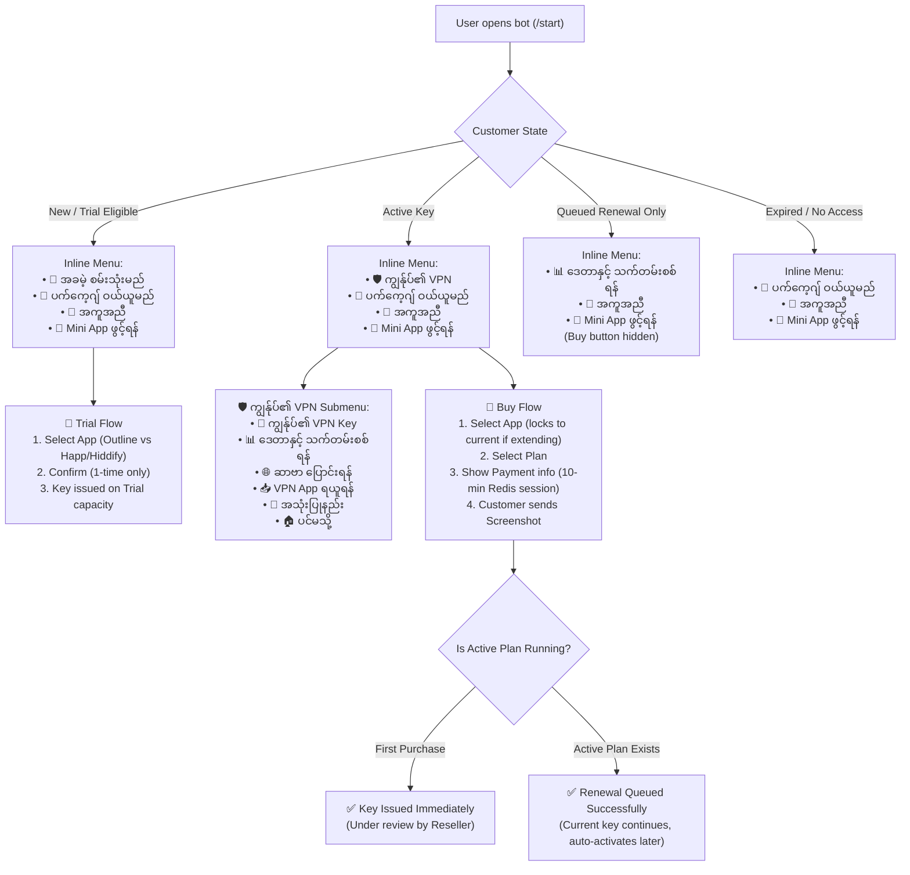

# NovaNet MM Telegram Bot: 10/10 UX Flow & Burmese Copy Master Review Document

> **How to use this document with ChatGPT / Copy Editors:**
> Copy this entire markdown document into ChatGPT or share it with your Burmese copywriter/editor. It provides 100% of the actual system architecture, exact code state machine, runtime constraints, and a complete line-by-line review catalog for every Burmese message in the bot.
>
> **Strict Style & Technical Rules:**
> 1. **Zero Code Changes Required (Current Flow Alignment):** Every proposal in Section 3 matches the **actual buttons and logic** present in `backend/src/bot/handlers.js` and `strings.js`. Proposed text never references buttons that do not exist on that screen.
> 2. **No "မီနူး"**: Avoid the transliterated word "မီနူး" (Menu). Use natural Burmese phrasing such as "အောက်ပါခလုတ်မှ" (from the buttons below), "အောက်တွင်" (below), or "ပင်မသို့" (Home/Main).
> 3. **No "ခင်ဗျာ" / "ရှင်"**: Do not use gendered particles. Maintain a modern, direct, polite, and professional tone using standard formal endings ("ပါသည်", "ပေးပါ", "နိုင်ပါသည်", "ပါ").
> 4. **Factual Accuracy**: No unverified marketing claims ("fastest server guaranteed"). Clear distinction between trial capacity and premium capacity, and between first-time key issuance vs queued renewal.

---

## 1. System & Business Model Context (Actual Code Architecture)

### Core Reseller & Bot Architecture
* **NovaNet MM** is a multi-tenant VPN reseller platform.
* Every reseller operates their own white-label Telegram Bot, Telegram Mini App, brand name, payment accounts (KPay, WavePay, etc.), pricing, and support contact.
* **App Families Supported**:
  * **Outline (Shadowsocks)**: Uses dynamic `ssconf://` access keys. 1-tap connect in Outline app.
  * **Happ / Hiddify / V2Box (VLESS)**: Multi-server subscription link + QR code.
* **Payment Model & Session Constraints**:
  * Manual mobile money transfer (KBZPay, WavePay, AYA Pay, CB Pay).
  * **The bot's purchase session lives in Redis for exactly 10 minutes** (`BUY_SESSION_TTL_SECONDS = 600`). The screenshot must be submitted within this window while the session is active (`handlers.js:1243`).
  * If a screenshot is sent without an active session, the bot cannot link it to an order automatically (`handlers.js:1245`); it replies with `BUY_NO_SESSION`.
* **First Purchase vs Renewal (Queued Order)**:
  * **First Paid Purchase**: Issues an immediate VPN key upon screenshot receipt, while the reseller reviews payment afterward.
  * **Queued Renewal**: If a customer with an active paid package buys another plan, it is registered as a **queued next package**. **No new key is issued immediately**; the active key continues running, and the new plan activates automatically once the current package expires (`strings.js:477`, `handlers.js:1269`).
* **Trial Restrictions**:
  * Trial is 1-time per customer.
  * Trial access is strictly restricted to **trial-tier server capacity** (Trial node/server only). Trial customers cannot switch to premium servers (`handlers.js:581`).
* **Screen Button Realities**:
  * On the "No Active Key" screen (`handlers.js:364`), the keyboard (`purchaseKeyboard`) has **only** `[🛒 ပက်ကေ့ဂျ် ဝယ်ရန်]` and `[🏠 ပင်မသို့]`. It does **not** have a Trial button.
  * On the "Server Switching" screen for VLESS users, server switching is handled inside their client app (Happ/Hiddify), so the bot does not switch individual nodes.

---

## 2. Customer Flow State Machine (As Implemented in Code)

---

## 3. Master Copy Review Catalog (100% Code-Aligned)

> **Important Constraints for Translation:**
> - Preserve Telegram HTML tags (`<b>`, `<i>`, `<code>`, `<pre>`, `<tg-emoji>`).
> - Preserve all template placeholders: `{brandName}`, `{customerName}`, `{planName}`, `{priceMmk}`, `{durationDays}`, `{dataLimitGb}`, `{usedGb}`, `{remainingGb}`, `{expiryDate}`, `{orderId}`.
> - Every proposal below aligns strictly with existing handler logic and buttons on screen.

### Group 1: Navigation & Persistent Keyboards

| Copy ID / Constant | Current Code Baseline | 10/10 Proposed Natural Burmese Copy | Exact Context & UX Rationale |
|---|---|---|---|
| `BTN.KEY` | `🔑 VPN Key ရယူရန်` | `🔑 ကျွန်ုပ်၏ VPN Key` | Submenu button under `menu:vpn`. "ကျွန်ုပ်၏" makes it clear that this accesses their personal active key. |
| `BTN.BALANCE` | `📊 လက်ကျန်စစ်ရန်` | `📊 ဒေတာနှင့် သက်တမ်းစစ်ရန်` | Submenu button under `menu:vpn`. "လက်ကျန်" alone is ambiguous; specifying data and expiry removes confusion. |
| `BTN.SERVER` | `🌐 Server ပြောင်းရန်` | `🌐 ဆာဗာ ပြောင်းရန်` | Submenu button under `menu:vpn`. Standardized Burmese spelling. |
| `BTN.DOWNLOAD` | `📥 App ဒေါင်းလုပ်` | `📥 VPN App ရယူရန်` | Submenu button under `menu:vpn` & `menu:help`. More professional than transliterated "ဒေါင်းလုပ်". |
| `BTN.HOWTO` | `📖 အသုံးပြုနည်း` | `📖 အသုံးပြုနည်း လမ်းညွှန်` | Submenu button under `menu:vpn` & `menu:help`. Welcoming and clear. |
| `BTN_TRIAL` | `🎁 အစမ်းသုံး ရယူရန်` | `🎁 အခမဲ့ စမ်းသုံးမည်` | Legacy reply keyboard label & start button. Action-oriented, highlights "အခမဲ့" (Free) to boost trial conversions. |
| `BTN_BUY` | `🛒 ပက်ကေ့ဂျ် ဝယ်ရန်` | `🛒 ပက်ကေ့ဂျ် ဝယ်ယူမည်` | Active buying intent. |
| `MENU_MY_VPN` | `ကျွန်ုပ်၏ VPN` | `🛡️ ကျွန်ုပ်၏ VPN` | Main menu button when user has an active key (`handlers.js:237`). Clean icon. |
| `MENU_HELP` | `အကူအညီ` | `💬 အကူအညီနှင့် လမ်းညွှန်` | Main menu button (`handlers.js:242`). Clarifies that guides and support are inside. |
| `MENU_HOME` | `ပင်မစာမျက်နှာ` | `🏠 ပင်မသို့` | Back-to-home button across submenus (`handlers.js:231`). Clean, short, avoids "မီနူး". |
| `MENU_BACK` | `နောက်သို့` | `⬅️ နောက်သို့` | Navigation back button. |

---

### Group 2: Welcome & Onboarding (`/start`)

| Copy ID / Constant | Current Code Baseline | 10/10 Proposed Natural Burmese Copy | Exact Context & UX Rationale |
|---|---|---|---|
| `startWelcome(brandName)` | `<b>${brandName}</b> မှ ကြိုဆိုပါတယ်။` | `🌐 <b>${brandName}</b> မှ နွေးထွေးစွာ ကြိုဆိုပါသည်! 🎉\n\nလိုင်းပိတ်ပင်မှုမရှိဘဲ လုံခြုံစွာ အင်တာနက် အသုံးပြုနိုင်ရန် VPN ဝန်ဆောင်မှု ပေးနေပါသည်။` | Sent on `/start` (`handlers.js:311`). Warm, trustworthy, directly states the core benefit. |
| `START_CTA_TEXT` | `ဘာလုပ်ချင်ပါသလဲ?` | `အောက်ပါခလုတ်များမှ မိမိအသုံးပြုလိုရာကို ရွေးချယ်ပါ 👇` | Sent as prompt above inline menu (`handlers.js:234`). Replaces blunt question with clear directional guidance. |
| `appOpenText(brandName)` | `<b>${name}</b> ကို အောက်ပါခလုတ်မှ ဖွင့်ပါ။` | `📱 <b>${name} Mini App</b> တွင် ဆာဗာများ၊ ပက်ကေ့ဂျ်များနှင့် အကောင့်အချက်အလက်များကို စီမံခန့်ခွဲနိုင်ပါသည် 👇` | Prompt before Mini App launch button. Explains the actual benefits of the Mini App. |
| `APP_BTN_OPEN` | `Mini App ဖွင့်မယ်` | `📱 Mini App ဖွင့်ရန်` | WebApp launch button on inline menu. Standard formal button. |

---

### Group 3: Free Trial Flow (`🎁 အခမဲ့ စမ်းသုံးမည်`)

| Copy ID / Constant | Current Code Baseline | 10/10 Proposed Natural Burmese Copy | Exact Context & UX Rationale |
|---|---|---|---|
| `TRIAL_SELECT_PROTOCOL` | `<b>အခမဲ့ စမ်းသုံးမယ်</b>\n\nဘယ် App နဲ့ သုံးမလဲ?` | `🎁 <b>အခမဲ့ စမ်းသုံးမည့် App ရွေးချယ်ပါ</b>\n\nမိမိ အသုံးပြုလိုသည့် VPN App အမျိုးအစားကို ရွေးချယ်ပါ —\n\n📱 <b>Outline App</b> (အသုံးပြုရ အလွယ်ကူဆုံး)\n🌐 <b>Happ / Hiddify / V2Box</b> (ဆာဗာစုံလင်စွာ အသုံးပြုနိုင်သည်)` | Prompt when selecting trial client (`handlers.js:964`). Clarifies that Outline is easiest; avoids making false speed claims. |
| `trial.confirm` *(literal in handlers.js)* | `<b>{app}</b> နဲ့ အခမဲ့ စမ်းသုံးမလား?\nအစမ်းသုံးခွင့် တစ်ကြိမ်သာ ရှိပါတယ်။` | `🎁 <b>{app}</b> ဖြင့် အခမဲ့ စမ်းသုံးရန် သေချာပါသလား?\n\nℹ️ <i>အခမဲ့စမ်းသုံးခွင့်ကို တစ်ကြိမ်သာ ရယူနိုင်မည် ဖြစ်ပါသည်။</i>` | Confirmation before provisioning trial (`handlers.js:987`). Courteous confirmation. |
| `trial.confirm.button` *(literal)* | `အတည်ပြုမယ်` | `✅ အခမဲ့ စမ်းသုံးမည်` | Action button confirming trial (`handlers.js:990`). Positive, clear action. |
| `TRIAL_PROCESSING` | `⏳ Trial Key ဖန်တီးနေသည်... ခဏစောင့်ပါ 🙏` | `⏳ အစမ်းသုံး VPN Key ဖန်တီးပေးနေပါသည်... ခဏစောင့်ဆိုင်းပေးပါ 🙏` | Processing toast/text during provisioning (`handlers.js:1003`). |
| `TRIAL_ALREADY_USED` | `အစမ်းသုံးခွင့်ကို ရယူပြီးပါပြီ။ Package ဝယ်ပြီး ဆက်သုံးနိုင်ပါတယ်။` | `ℹ️ လူကြီးမင်းထံတွင် အခမဲ့စမ်းသုံးခွင့် (၁) ကြိမ် ရယူအသုံးပြုပြီး ဖြစ်ပါသည်။\n\nဆက်လက်အသုံးပြုလိုပါက 🛒 <b>ပက်ကေ့ဂျ် ဝယ်ယူမည်</b> ကို နှိပ်၍ ပက်ကေ့ဂျ်များကို ဝယ်ယူနိုင်ပါသည်။` | Shown when user taps trial again (`handlers.js:968`). Note: Attached keyboard is `purchaseKeyboard` (Buy & Home), which matches this text perfectly. |
| `TRIAL_ERROR` | `⚠️ Trial Key ဖန်တီးရာတွင် အမှားဖြစ်သွားသည်။\nခဏကြာပြီးနောက် ထပ်ကြိုးစားပါ သို့မဟုတ် Admin ကို ဆက်သွယ်ပါ။` | `⚠️ စနစ်ချိတ်ဆက်မှု ခေတ္တမအားလပ်သေးပါသဖြင့် ခဏအကြာတွင် ထပ်မံကြိုးစားပေးပါ။ အကူအညီလိုအပ်ပါက Admin ထံ ဆက်သွယ်နိုင်ပါသည်။` | Provisioning failure notice. |

---

### Group 4: Purchase & Payment Flow (`🛒 ပက်ကေ့ဂျ် ဝယ်ယူမည်`)

| Copy ID / Constant | Current Code Baseline | 10/10 Proposed Natural Burmese Copy | Exact Context & UX Rationale |
|---|---|---|---|
| `BUY_SELECT_PROTOCOL` | `📶 <b>Protocol ရွေးချယ်ပါ</b>\n\n 📱 <b>Outline</b>\n └ Outline app...\n 🌐 <b>VLESS</b>\n └ Hiddify...` | `📶 <b>အသုံးပြုလိုသည့် App ရွေးချယ်ပါ</b>\n\n📱 <b>Outline App</b> (အသုံးပြုရ အလွယ်ကူဆုံး)\n🌐 <b>Happ / Hiddify / V2Box</b> (ဆာဗာစုံလင်စွာ အသုံးပြုနိုင်သည်)` | Prompt when buyer has no active key (`handlers.js:1149`). Guides by app preference without jargon. |
| `BUY_SELECT_PLAN` | `🛒 <b>ပက်ကေ့ဂျ် ရွေးချယ်ပါ</b>\n\nအောက်ပါ package များမှ သင်နှစ်သက်ရာတစ်ခုကို ရွေးချယ်ပေးပါ 👇` | `🛒 <b>ပက်ကေ့ဂျ် ရွေးချယ်ရန်</b>\n\nမိမိ အသုံးပြုလိုသည့် ဒေတာနှင့် ရက်သက်တမ်း ပက်ကေ့ဂျ်ကို ရွေးချယ်ပါ 👇` | Prompt above plan buttons (`handlers.js:1172`). |
| `buyPaymentInstructions` | `📦 <b>{plan.name}</b>\n💰 {price} MMK\n📊 {data} GB \| ⏰ {days} ရက်\n\n💳 <b>ငွေပေးချေနည်း</b>\n{methods}\n\n📸 ငွေလွှဲပြီးပါက <b>ငွေပေးချေမှု screenshot</b> ကို ဤ chat တွင် ပေးပို့ပါ 👇\n\n⏱ <i>မိနစ် ၁၀ အတွင်း screenshot မပေးပို့ပါက အော်ဒါ ဆက်မလုပ်ဆောင်ပဲ ဖျက်သွားမည်ဖြစ်သည်။</i>` | `📦 <b>{plan.name}</b>\n💰 ကျသင့်ငွေ: <b>{price} MMK</b>\n📊 ဒေတာ: <b>{data} GB</b>  \|  ⏰ သက်တမ်း: <b>{days} ရက်</b>\n\n💳 <b>ငွေပေးချေရမည့် အကောင့်များ:</b>\n{methods}\n\n📸 <b>ငွေလွှဲပြီးပါက ငွေလွှဲပြေစာ (Screenshot) ကို ဤနေရာတွင် ပေးပို့ပါ 👇</b>\n\n⏱ <i>မိနစ် ၁၀ အတွင်း ငွေလွှဲပြေစာ ပေးပို့ပေးပါရန် မေတ္တာရပ်ခံအပ်ပါသည်။</i>` | **Accurate Technical Fix:** Keeps the real 10-minute Redis session requirement, but softens "ဖျက်သွားမည်" into polite, professional phrasing. |
| `BUY_PROCESSING` | `⏳ စစ်ဆေးနေပါသည်... ခဏစောင့်ပါ 🙏` | `⏳ ပြေစာကို လက်ခံရရှိပြီး စစ်ဆေးဆောင်ရွက်နေပါသည်... ခဏစောင့်ဆိုင်းပေးပါ 🙏` | Shown right after photo upload (`handlers.js:1249`). |
| `buySuccessText` | `✅ <b>{planName}</b> ပက်ကေ့ဂျ် စတင်ပါပြီ!\n\n🔑 သင်၏ VPN Key (Subscription URL):\n<pre>{url}</pre>\n...\n⚠️ ငွေပေးချေမှုကို Reseller မှ စစ်ဆေးနေပါသည်။ မမှန်ကန်ပါက ဝန်ဆောင်မှု ရပ်နားမည်ဖြစ်သည်။` | `🎉 <b>{planName} ပက်ကေ့ဂျ် စတင်အသုံးပြုနိုင်ပါပြီ!</b>\n\n🔑 <b>သင်၏ VPN Key:</b>\n<code>{url}</code>\n<i>(Key ပေါ်တွင် တစ်ချက်နှိပ်၍ အလွယ်တကူ Copy ယူနိုင်ပါသည်)</i>\n\n📅 သက်တမ်းကုန်ဆုံးမည့်ရက်: <b>{expiryDate}</b>\n\nℹ️ <i>ငွေလွှဲပြေစာကို လူကြီးမင်း စိတ်ချစွာ အသုံးပြုနိုင်ရန် စနစ်နှင့် Admin မှ စစ်ဆေးဆောင်ရွက်ပေးနေပါသည်။</i>` | **First Purchase Success:** Sent when customer had no active key (`handlers.js:1286`). Reassures tap-to-copy. Softens reseller verification warning. |
| `buyExtendSuccessText` | `✅ <b>{planName}</b> ပက်ကေ့ဂျ်ကို Queue ထဲသို့ ထည့်သွင်းပြီးပါပြီ!\n...\nℹ️ ဤပက်ကေ့ဂျ်သည် သင်၏ လက်ရှိ Package သက်တမ်းကုန်ဆုံးပါက (သို့မဟုတ်) Data ကုန်သွားပါက အလိုအလျောက် စတင်အသုံးပြုနိုင်မည်ဖြစ်ပါသည်။` | `🎉 <b>{planName} သက်တမ်းတိုး ပက်ကေ့ဂျ် ဝယ်ယူမှု အောင်မြင်ပါသည်!</b>\n\n📊 ဒေတာ: <b>{dataLimitGb} GB</b>  \|  ⏰ သက်တမ်း: <b>{durationDays} ရက်</b>\n\n✅ <b>လက်ရှိရက်များ မဆုံးရှုံးပါ:</b>\nလက်ရှိ ပက်ကေ့ဂျ် ကုန်ဆုံးသွားပါက ဤပက်ကေ့ဂျ်မှ အလိုအလျောက် ဆက်လက်သက်တမ်းတိုး အလုပ်လုပ်ပေးမည် ဖြစ်ပါသည်။` | **Renewal Success:** Sent when customer ALREADY had an active plan (`handlers.js:1274`). Reassures that current days are safe and will auto-renew. |
| `BUY_ALREADY_QUEUED` | `ℹ️ သင့်တွင် လက်ရှိ package အပြင် စောင့်ဆိုင်းနေသော (Queue) package တစ်ခု ရှိနေပြီးဖြစ်သည်။\n...` | `ℹ️ လူကြီးမင်းထံတွင် လက်ရှိအသုံးပြုနေသော ပက်ကေ့ဂျ်အပြင် ကြိုတင်သက်တမ်းတိုးထားသော ပက်ကေ့ဂျ် (၁) ခု ရှိနှင့်ပြီး ဖြစ်ပါသည်။\n\nအဆိုပါပက်ကေ့ဂျ်များ အသုံးပြုပြီးမှသာ နောက်ထပ် ထပ်မံဝယ်ယူနိုင်မည် ဖြစ်ပါသည်။\n📊 လက်ကျန်စစ်ဆေးရန် <b>📊 ဒေတာနှင့် သက်တမ်းစစ်ရန်</b> ကို နှိပ်ပါ 👇` | Shown when user tries to buy a third plan while one is active and one is already queued (`handlers.js:1134`). |
| `BUY_CANCELLED` | `❌ ပက်ကေ့ဂျ် ဝယ်ယူမှု ဖျက်သိမ်းပါပြီ။\nပြန်လည် ဝယ်ယူလိုပါက 🛒 ကိုနှိပ်ပါ။` | `❌ ပက်ကေ့ဂျ် ဝယ်ယူမှုကို ပယ်ဖျက်လိုက်ပါပြီ။\n\nပြန်လည်ဝယ်ယူလိုပါက အောက်ပါခလုတ်မှ 🛒 <b>ပက်ကေ့ဂျ် ဝယ်ယူမည်</b> ကို နှိပ်နိုင်ပါသည် 👇` | Shown on `buy:cancel` (`handlers.js:1233`). Avoids "မီနူး". |
| `BUY_NO_SESSION` | `📸 Screenshot ရရှိပါပြီ — သို့သော် ဝယ်ယူမှု session မရှိပါ။\nဝယ်ယူရန် 🛒 <b>ပက်ကေ့ဂျ် ဝယ်ရန်</b> ကိုနှိပ်ပြီး package ရွေးပါ။` | `📸 ငွေလွှဲပြေစာ ပေးပို့ထားသည်ကို တွေ့ရှိရပါသည်။ သို့သော် ဝယ်ယူမည့် ပက်ကေ့ဂျ်ကို မရွေးချယ်ရသေးပါသဖြင့် ဦးစွာ 🛒 <b>ပက်ကေ့ဂျ် ဝယ်ယူမည်</b> ကို နှိပ်ပြီး ပက်ကေ့ဂျ် ရွေးချယ်ပေးပါရန် မေတ္တာရပ်ခံအပ်ပါသည်။` | **Accurate Technical Fix:** Accurately reflects current code (`handlers.js:1245`), where the bot cannot associate an unsolicited slip without a session. |

---

### Group 5: Key Display & Setup Instructions (`🔑 ကျွန်ုပ်၏ VPN Key`)

| Copy ID / Constant | Current Code Baseline | 10/10 Proposed Natural Burmese Copy | Exact Context & UX Rationale |
|---|---|---|---|
| `keyFoundHeader` | `🔑 ယခု <b>{customerName}</b> အကောင့်အတွက် VPN Key မှာ:` | `🔑 <b>{customerName}</b> အတွက် VPN ချိတ်ဆက်ရန် Key:` | Header above active key display (`handlers.js:347`). |
| `keyServerLine` | `🌐 Linked Server: {flag} {serverName}` | `🌐 ချိတ်ဆက်ထားသော ဆာဗာ: {flag} <b>{serverName}</b>` | Shown below Outline key (`handlers.js:357`). |
| `KEY_COPY_INSTRUCTIONS_SS` | `📋 URL ကို tap/copy ကူး၍ <b>Outline</b> app တွင် ထည့်ပါ။\n App မရှိသေးပါက 📥 <b>App ဒေါင်းလုပ်</b> ကို နှိပ်ပါ။` | `📋 <b>အသုံးပြုနည်း:</b>\n၁။ အထက်ပါ Key ကို နှိပ်ပြီး Copy ယူပါ\n၂။ <b>Outline App</b> ကိုဖွင့်ပြီး ထည့်သွင်းပါ\n၃။ <b>Connect</b> ကိုနှိပ်ပြီး စတင်အသုံးပြုနိုင်ပါပြီ ✅\n\n<i>(App မရှိသေးပါက အောက်ပါ 📥 VPN App ရယူရန် ကို နှိပ်ပါ)</i>` | 3-step numbered guide for Outline users (`handlers.js:367`). Button `KEY_BTN_DOWNLOAD` is attached directly below. |
| `KEY_COPY_INSTRUCTIONS` | `📋 QR scan (သို့) URL ကို copy ကူး၍ <b>Hiddify / Happ / V2Box</b> တွင်\n Subscription URL အဖြစ် ထည့်ပါ။ App မရှိသေးပါက 📥 <b>App ဒေါင်းလုပ်</b> ကို နှိပ်ပါ။` | `📋 <b>အသုံးပြုနည်း:</b>\n၁။ အထက်ပါ QR ကို Scan ဖတ်ပါ (သို့) Key ကို Copy ယူပါ\n၂။ <b>Happ / Hiddify / V2Box</b> ထဲတွင် ထည့်သွင်းပါ\n၃။ ဆာဗာရွေးချယ်ပြီး <b>Connect</b> ကို နှိပ်ပါ ✅\n\n<i>(App မရှိသေးပါက အောက်ပါ 📥 VPN App ရယူရန် ကို နှိပ်ပါ)</i>` | 3-step guide for VLESS users (`handlers.js:372`). |
| `KEY_NO_ACTIVE` | `လက်ရှိ အသုံးပြုနိုင်သော VPN Key မရှိပါ။\nအောက်ပါခလုတ်မှ package ဝယ်နိုင်ပါတယ်။` | `❌ လူကြီးမင်းတွင် လက်ရှိ အသုံးပြုနိုင်သော VPN Package မရှိသေးပါ။\n\nအောက်ပါခလုတ်မှတစ်ဆင့် ပက်ကေ့ဂျ် ဝယ်ယူနိုင်ပါသည် 👇` | **Accurate Technical Fix:** Attached keyboard (`purchaseKeyboard`, `handlers.js:270`) ONLY has Buy and Home buttons. Proposed text matches buttons on screen exactly. |
| `KEY_ERROR` | `⚠️ Key ရယူရာတွင် အမှားဖြစ်သွားသည်။ ခဏကြာပြီးနောက် ထပ်ကြိုးစားပါ။` | `⚠️ Key အချက်အလက် ခေါ်ယူရာတွင် ခေတ္တမအားလပ်သေးပါသဖြင့် ခဏအကြာတွင် ထပ်မံကြိုးစားပေးပါ။` | Error during database/network fetch (`handlers.js:401`). |

---

### Group 6: Quota, Balance & Expiry (`📊 ဒေတာနှင့် သက်တမ်းစစ်ရန်`)

| Copy ID / Constant | Current Code Baseline | 10/10 Proposed Natural Burmese Copy | Exact Context & UX Rationale |
|---|---|---|---|
| `balanceText` | `📊 <b>လက်ကျန် GB စစ်ဆေးရန်:</b>\n\n📈 အသုံးပြုပြီး: <b>{used} GB</b>\n📉 လက်ကျန်: <b>{remaining}</b>\n...\nအသေးစိတ်ကို VPN app တွင် ဆက်လက်ကြည့်ရှုနိုင်ပါသည်။ အောက်ပါ <b>Open VPN</b> ကို နှိပ်ပါ 👇` | `📊 <b>သင်၏ VPN ဒေတာနှင့် သက်တမ်း အခြေအနေ:</b>\n\n📈 အသုံးပြုထားသော ဒေတာ: <b>{used} GB</b>\n📉 ကျန်ရှိသော ဒေတာ: <b>{remaining}</b>\n📅 သက်တမ်းကုန်ဆုံးမည့်ရက်: <b>{expiryDate}</b>{queuedSection}\n\nအသေးစိတ် အချက်အလက်များကို 📱 <b>Mini App</b> တွင်လည်း အပြည့်အစုံ ကြည့်ရှုနိုင်ပါသည် 👇` | Usage card for active customers (`handlers.js:446`). Replaces misleading "Open VPN" with "Mini App". |
| `balanceQueuedOnlyText` | `📊 <b>လက်ကျန် အချက်အလက်:</b>\n\n❌ လက်ရှိ active package မရှိသေးပါ။\n\n⏳ <b>တန်းစီထားသော ပက်ကေ့ချ် (Next in Queue):</b>...` | `📊 <b>သင်၏ VPN အကောင့် အခြေအနေ:</b>\n\nℹ️ လက်ရှိ အသုံးပြုနေသော ပက်ကေ့ဂျ် သက်တမ်းကုန်ဆုံးသွားပါပြီ။\n\n⏳ <b>ကြိုတင်ဝယ်ယူထားသော သက်တမ်းတိုး ပက်ကေ့ဂျ်:</b>\n📦 <b>{planName}</b>\n📊 ဒေတာ: <b>{data}</b>  \|  ⏰ သက်တမ်း: <b>{days}</b>\n\n✅ <i>မကြာမီ စနစ်မှ အလိုအလျောက် သက်တမ်းတိုး ချိတ်ဆက်ပေးပါမည်။</i>` | Shown when active plan ended but queued renewal is waiting (`handlers.js:433`). Prevents user panic. |

---

### Group 7: Server Switching (`🌐 ဆာဗာ ပြောင်းရန်`)

| Copy ID / Constant | Current Code Baseline | 10/10 Proposed Natural Burmese Copy | Exact Context & UX Rationale |
|---|---|---|---|
| `serverChooseText(isTrial)` | `🌐 <b>Server ရွေးချယ်ပါ</b>\n\nချိတ်ဆက်လိုသော server ကို နှိပ်ပါ 👇` | `🌐 <b>ချိတ်ဆက်လိုသည့် ဆာဗာကို ရွေးချယ်ပါ</b>\n\nအသုံးပြုလိုသော ဆာဗာတစ်ခုကို ရွေးချယ်ပါ 👇` | Prompt on server list (`handlers.js:571`). Clean, no unverified speed claims. |
| `SERVER_NO_ACTIVE` | `Server ပြောင်းရန် လက်ရှိအသုံးပြုနိုင်သော package လိုပါတယ်။` | `ဆာဗာ ပြောင်းလဲရန် လက်ရှိ အသုံးပြုနေသော ပက်ကေ့ဂျ် ရှိရန် လိုအပ်ပါသည်။ အောက်ပါခလုတ်မှတစ်ဆင့် ပက်ကေ့ဂျ် ဝယ်ယူနိုင်ပါသည် 👇` | Shown when user with no active plan taps server switch (`handlers.js:564`). Attached keyboard is `purchaseKeyboard` (Buy and Home). |
| `SERVER_SWITCHING` | `⏳ Server ပြောင်းနေသည်... ခဏစောင့်ပါ 🙏` | `⏳ ဆာဗာ ပြောင်းလဲပေးနေပါသည်... ခဏစောင့်ဆိုင်းပေးပါ 🙏` | Shown while updating key (`handlers.js:712`). |
| `serverSwitchSuccess(flag, name)` | `✅ <b>{flag} {name}</b> သို့ ပြောင်းပြီးပါပြီ!\n\n🔑 <b>VPN Key ရယူရန်</b> ကို နှိပ်ပါ` | `✅ <b>{flag} {name}</b> သို့ အောင်မြင်စွာ ပြောင်းလဲပြီးပါပြီ!\n\nKey အသစ်ဖြင့် ချိတ်ဆက်ရန် အောက်ပါ <b>🔑 ကျွန်ုပ်၏ VPN Key</b> ကို နှိပ်ပါ 👇` | Success feedback after switch (`handlers.js:744`). |
| `SERVER_VLESS_EXPLAIN` | `🌐 <b>VLESS Subscription</b>\n\nသင့် VLESS subscription သည် server အားလုံးကို အလိုအလျောက် ပေါင်းစပ်ပေးသည်။\n...\nServer ကို manual ပြောင်းလိုပါက app ထဲ၌ node list မှ ပြောင်းနိုင်ပါသည်` | `🌐 <b>ဆာဗာ ရွေးချယ်မှု လမ်းညွှန်</b>\n\nလူကြီးမင်း အသုံးပြုနေသည့် <b>Happ / Hiddify / V2Box</b> App ထဲတွင် ဆာဗာအားလုံး ပါဝင်ပြီး ဖြစ်ပါသည်ခင်ဗျာ။\n\nဆာဗာ ပြောင်းလဲလိုပါက App ထဲရှိ ဆာဗာစာရင်းမှ မိမိနှစ်သက်ရာကို တိုက်ရိုက် ရွေးချယ် အသုံးပြုနိုင်ပါသည်။` | **Accurate Technical Fix:** Shown to PREMIUM VLESS customers (`handlers.js:544`). Informs them that server switching is done directly inside their app. |
| `SERVER_VLESS_TRIAL` | `⚡ <b>VLESS Trial · Trial Server သာ</b>\n\nTrial VLESS key သည် <b>Trial server တစ်ခုသာ</b> ချိတ်ဆက်နိုင်သည်။\n\n🔓 <b>Server အားလုံးသို့ ချိတ်ဆက်ရန်</b> Premium package ဝယ်ယူပါ —...` | `⚡ <b>အစမ်းသုံး ဆာဗာ သီးသန့် ချိတ်ဆက်မှု</b>\n\nအစမ်းသုံး (Trial) Key သည် သတ်မှတ်ထားသော အစမ်းသုံး ဆာဗာတစ်ခုတည်းနှင့်သာ ချိတ်ဆက်နိုင်ပါသည်ခင်ဗျာ။\n\nဆာဗာအားလုံးကို စိတ်တိုင်းကျ ရွေးချယ် အသုံးပြုလိုပါက 🛒 <b>ပက်ကေ့ဂျ် ဝယ်ယူမည်</b> ကို နှိပ်၍ ပက်ကေ့ဂျ် ဝယ်ယူနိုင်ပါသည်။` | **Accurate Technical Fix:** Shown to TRIAL VLESS customers (`handlers.js:554`). Accurately states that trial is restricted to trial capacity. |
| `SERVER_TRIAL_LOCKED` | `🔒 <b>Premium Server — paid package လိုအပ်သည်</b>\n\nTrial package သည် Trial server သာ သုံးနိုင်သည်။...` | `🔒 <b>Premium ဆာဗာ ဖြစ်ပါသည်</b>\n\nဤဆာဗာသည် Paid Package ဝယ်ယူထားသူများအတွက် သီးသန့် ဖြစ်ပါသည်။ ဆာဗာအားလုံး အသုံးပြုနိုင်ရန် 🛒 <b>ပက်ကေ့ဂျ် ဝယ်ယူမည်</b> ကို နှိပ်ပါ 👇` | Shown when trial user taps a premium server in Outline picker (`handlers.js:685`). |
| `SERVER_ALREADY_LINKED`| `✅ ဤ server နှင့် ချိတ်ဆက်ပြီးဖြစ်သည်` | `✅ လက်ရှိတွင် ဤဆာဗာနှင့် ချိတ်ဆက်ထားပြီး ဖြစ်ပါသည်` | Toast/text when tapping current server (`handlers.js:693`). |

---

### Group 8: Reseller Admin Notifications & Customer Confirmations

| Copy ID / Constant | Current Code Baseline | 10/10 Proposed Natural Burmese Copy | Exact Context & UX Rationale |
|---|---|---|---|
| `resellerNotifyCaption` | `💰 <b>ငွေပေးချေမှု ရောက်ရှိလာပါပြီ</b>\n👤 Customer: <b>{name}</b>\n📦 Package: <b>{plan}</b>\n💵 {price} MMK...\n✅ မှန်ကန်ပါက <b>အတည်ပြုမည်</b> ကို နှိပ်ပါ` | `💰 <b>ငွေလွှဲပြေစာ အသစ် ရောက်ရှိလာပါပြီ</b>\n\n👤 ဝယ်ယူသူ: <b>{customerName}</b>\n📦 ပက်ကေ့ဂျ်: <b>{planName}</b>{isExtend ? " (သက်တမ်းတိုး)" : ""}\n💵 ကျသင့်ငွေ: <b>{priceMmk} MMK</b>\n📊 ဒေတာ: <b>{dataLimitGb} GB</b>  \|  ⏰ သက်တမ်း: <b>{durationDays} ရက်</b>\n🆔 အော်ဒါအမှတ်: <code>{orderId}</code>\n\n<i>ငွေလွှဲပြေစာ မှန်ကန်မှုရှိပါက အောက်ပါခလုတ်ဖြင့် အတည်ပြုပေးပါ 👇</i>` | Photo caption sent to reseller Telegram chat (`handlers.js:1289`). Clear layout. |
| `NOTIFY_CONFIRM_BTN` | `✅ အတည်ပြုမည်` | `✅ ပြေစာ မှန်ကန်သည် (အတည်ပြုမည်)` | Reseller inline button (`strings.js:566`). Explicit confirmation. |
| `NOTIFY_REJECT_BTN` | `❌ ငြင်းပယ်မည်` | `❌ ပြေစာ မမှန်ကန်ပါ (ငြင်းပယ်မည်)` | Reseller inline button (`strings.js:567`). Prevents misclicks. |
| `CUSTOMER_PAYMENT_CONFIRMED` | `✅ <b>ငွေပေးချေမှု အတည်ပြုပါပြီ</b> 🎉\n\n🔑 VPN Key ရယူရန် — <b>🔑 VPN Key ရယူရန်</b> ကို နှိပ်ပါ` | `🎉 <b>ငွေပေးချေမှု အောင်မြင်စွာ အတည်ပြုပြီးပါပြီ!</b>\n\nလူကြီးမင်း၏ VPN ဝန်ဆောင်မှုကို စိတ်တိုင်းကျ စတင်အသုံးပြုနိုင်ပါပြီ။\n🔑 သင်၏ VPN Key ကို ရယူရန် အောက်ပါခလုတ်ကို နှိပ်ပါ 👇` | DM sent to customer when reseller confirms (`handlers.js:1326`). |
| `CUSTOMER_PAYMENT_REJECTED` | `❌ <b>ငွေပေးချေမှု အတည်မပြုနိုင်ပါ</b>\n\nငွေပေးချေမှု မမှန်ကန်သောကြောင့် ဝန်ဆောင်မှု ရပ်နားသွားပါပြီ။\n\nအသေးစိတ် မေးမြန်းရန် Admin ကို ဆက်သွယ်ပါ 👇` | `⚠️ <b>ငွေပေးချေမှု စစ်ဆေး၍ မရသေးပါ</b>\n\nပေးပို့ထားသော ငွေလွှဲပြေစာတွင် အချက်အလက် မကိုက်ညီမှု ရှိနေပါသဖြင့် အကောင့်ကို ခေတ္တရပ်နားထားပါသည်။\n\nအမှားအယွင်း တစ်စုံတစ်ရာ ရှိပါက အောက်ပါ Admin ထံ တိုက်ရိုက် မေးမြန်းဆက်သွယ်နိုင်ပါသည်။` | DM sent to customer when reseller rejects (`handlers.js:1347`). Constructive and polite tone. |

---

### Group 9: Automated Push Notifications (Matching Exact Code Defaults in `notificationTemplates.js`)

> *Note: These are platform defaults from `backend/src/bot/notificationTemplates.js:130`. Resellers can also customize these per-reseller in their dashboard.*

| Event ID | Exact Code Baseline (`DEFAULT_TEMPLATES`) | 10/10 Proposed Natural Burmese Copy | Purpose & Trigger |
|---|---|---|---|
| `trial_ending_24h` | `<b>⏰ trial ending soon!</b>\n\nသင့် အစမ်းသုံးပက်ကေ့ချ်သည် နောက် ၂၄ နာရီ အတွင်း ကုန်ဆုံးမည်ဖြစ်ပါသည်။\n📅 ကုန်ဆုံးရက်: {expiry_date}\nပက်ကေ့ဂျ်အသစ်ဝယ်ယူရန် အောက်ပါ “Package ဝယ်ရန်” ခလုတ်ကိုနှိပ်ပြီး {price_from_mmk} ကျပ်မှစ၍ဝယ်ယူအားပေးနိုင်ပါတယ် 👇` | `<b>⏰ အခမဲ့ စမ်းသုံးခွင့် မနက်ဖြန် ကုန်ဆုံးပါမည်</b>\n\nလူကြီးမင်း၏ အခမဲ့စမ်းသုံးခွင့်သည် နောက် ၂၄ နာရီအတွင်း ကုန်ဆုံးမည် ဖြစ်ပါသည်။\n📅 ကုန်ဆုံးရက်: <b>{expiry_date}</b>\n\nအင်တာနက် အဆက်မပြတ် သုံးစွဲနိုင်ရန် အောက်ပါ "Package ဝယ်ရန်" ခလုတ်မှတစ်ဆင့် {price_from_mmk} ကျပ်မှစ၍ ကြိုတင်ဝယ်ယူနိုင်ပါသည် 👇` | Proactive retention push 24 hours before trial expires. |
| `trial_expired` | `<b>❌ trial expired!</b>\n\nသင့်အစမ်းသုံးပက်ကေ့ချ်သည် ကုန်ဆုံးသွားပါပြီ။\nပက်ကေ့ဂျ်အသစ်ဝယ်ယူရန် အောက်ပါ "Package ဝယ်ရန်" ခလုတ်ကိုနှိပ်ပြီး {price_from_mmk} ကျပ်မှစ၍ဝယ်ယူအားပေးနိုင်ပါတယ် 👇\n\nအကူအညီ လိုပါက Admin ကို ဆက်သွယ်ပါ 👇` | `<b>⌛ အခမဲ့ စမ်းသုံးခွင့် သက်တမ်း ကုန်ဆုံးသွားပါပြီ</b>\n\nလူကြီးမင်း၏ အခမဲ့စမ်းသုံးခွင့် သက်တမ်း ကုန်ဆုံးသွားပါပြီ။\n\nဆက်လက်အသုံးပြုလိုပါက အောက်ပါ "Package ဝယ်ရန်" ခလုတ်မှတစ်ဆင့် {price_from_mmk} ကျပ်မှစ၍ ပက်ကေ့ဂျ် အသစ်ကို ရွေးချယ်ဝယ်ယူနိုင်ပါသည် 👇\n\nအကူအညီ လိုအပ်ပါက Admin ထံ ဆက်သွယ်နိုင်ပါသည် 👇` | Sent on the calendar day a trial expires. |
| `subscription_expiring_3d`| `<b>⏰ package ending soon!</b>\n\nသင့် {plan_name} Package သည် နောက် ၃ ရက် အတွင်း ကုန်ဆုံးမည်။\n📅 ကုန်ဆုံးရက်: {expiry_date}\nသက်တမ်းတိုးရန် အောက်ပါ "Package ဝယ်ရန်" ခလုတ်ကိုနှိပ်ပြီး ဆက်လက်အသုံးပြုနိုင်ပါတယ် 👇` | `<b>⏰ ပက်ကေ့ဂျ် သက်တမ်း (၃) ရက်သာ ကျန်ရှိပါတော့သည်</b>\n\nလူကြီးမင်း၏ <b>{plan_name}</b> ပက်ကေ့ဂျ်သည် နောက် ၃ ရက်အတွင်း ကုန်ဆုံးမည် ဖြစ်ပါသည်။\n📅 ကုန်ဆုံးရက်: <b>{expiry_date}</b>\n\nအင်တာနက်လိုင်း ပြတ်တောက်မှုမရှိစေရန် အောက်ပါ "Package ဝယ်ရန်" ခလုတ်မှတစ်ဆင့် ကြိုတင်သက်တမ်းတိုးထားနိုင်ပါသည် 👇` | Advance renewal reminder 3 days before paid package expires. |
| `subscription_expired` | `<b>❌ package expired!</b>\n\nသင့် {plan_name} Package သည် ကုန်ဆုံးသွားပါပြီ။\nသက်တမ်းတိုးရန် အောက်ပါ "Package ဝယ်ရန်" ခလုတ်ကိုနှိပ်ပါ 👇\n\nအကူအညီ လိုပါက Admin ကို ဆက်သွယ်ပါ 👇` | `<b>⌛ ပက်ကေ့ဂျ် သက်တမ်း ကုန်ဆုံးသွားပါပြီ</b>\n\nလူကြီးမင်း၏ <b>{plan_name}</b> ပက်ကေ့ဂျ် သက်တမ်း ကုန်ဆုံးသွားပါပြီ။\n\nVPN ကို ဆက်လက်အသုံးပြုလိုပါက အောက်ပါ "Package ဝယ်ရန်" ခလုတ်မှတစ်ဆင့် ပက်ကေ့ဂျ် အသစ်ကို ချက်ချင်း ပြန်လည်ဝယ်ယူနိုင်ပါသည် 👇\n\nအကူအညီ လိုအပ်ပါက Admin ထံ ဆက်သွယ်နိုင်ပါသည် 👇` | Sent on the calendar day a paid package expires. |
| `payment_confirmed` | `<b>✅ payment confirmed!</b>\n\nကျေးဇူးတင်ပါတယ်! သင့်ငွေပေးချေမှုကို အတည်ပြုပြီးပါပြီ 🎉\n\n📦 Package: {plan_name}\n📅 သက်တမ်း: {expiry_date} အထိ\n\nKey ရယူဖို့ အောက်က 🔑 VPN Key ရယူရန် ခလုတ်ကို နှိပ်ပါ 👇` | `<b>🎉 ငွေပေးချေမှု အတည်ပြုပြီးပါပြီ</b>\n\nကျေးဇူးတင်ရှိပါသည်! သင့်ငွေပေးချေမှုကို အောင်မြင်စွာ အတည်ပြုပြီးပါပြီ 🎉\n\n📦 ပက်ကေ့ဂျ်: <b>{plan_name}</b>\n📅 သက်တမ်း: <b>{expiry_date}</b> အထိ\n\nVPN Key ရယူရန် အောက်ပါ "🔑 VPN Key ရယူရန်" ခလုတ်ကို နှိပ်ပါ 👇` | Automated push event when `review_status` becomes confirmed. |
| `payment_rejected` | `<b>❌ payment rejected!</b>\n\nသင့်ငွေပေးချေမှုအား အတည်မပြုနိုင်ပါ\n\n📦 Package: {plan_name}\n📝 အကြောင်းရင်း: {reject_reason}\n\nပြန်လည် ငွေပေးချေရန်၊ သို့မဟုတ် အကူအညီ လိုပါက Admin ကို ဆက်သွယ်ပါ 👇` | `<b>⚠️ ငွေပေးချေမှု အတည်မပြုနိုင်ပါ</b>\n\nသင့်ငွေပေးချေမှုအား အတည်မပြုနိုင်သေးပါခင်ဗျာ။\n\n📦 ပက်ကေ့ဂျ်: <b>{plan_name}</b>\n📝 အကြောင်းရင်း: <b>{reject_reason}</b>\n\nပြန်လည် ငွေပေးချေရန် သို့မဟုတ် အကူအညီ လိုအပ်ပါက Admin ထံ ဆက်သွယ်နိုင်ပါသည် 👇` | Automated push event when `review_status` becomes rejected. |
| `data_limit_warning` | `<b>⚠️ data limit ကုန်ခါနီးပြီ!</b>\n\nသင့် {plan_name} ၏ data ကို {percent_used}% အသုံးပြုပြီးပါပြီ — လက်ကျန် {remaining_gb} GB သာ ရှိပါတော့သည်။\nData ကုန်သွားပါက VPN ချိတ်ဆက်မှု ချက်ချင်း ရပ်တန့်သွားပါလိမ့်မည်။\nကြိုတင်ဝယ်ယူထားလိုပါက အောက်ပါ "Package ဝယ်ရန်" ခလုတ်ကိုနှိပ်ပါ 👇` | `<b>⚠️ ဒေတာ ပမာဏ ၈၀% အသုံးပြုပြီးပါပြီ</b>\n\nလူကြီးမင်း၏ <b>{plan_name}</b> ပက်ကေ့ဂျ်မှ ဒေတာကို <b>{percent_used}%</b> အသုံးပြုပြီးဖြစ်ပါသည် — လက်ကျန် <b>{remaining_gb} GB</b> သာ ရှိပါတော့သည်။\n\nဒေတာကုန်သွားပါက VPN ချိတ်ဆက်မှု ရပ်တန့်နိုင်ပါသဖြင့် အောက်ပါ "Package ဝယ်ရန်" ခလုတ်မှတစ်ဆင့် ဒေတာ ကြိုတင်ဖြည့်တင်းနိုင်ပါသည် 👇` | Sent at 80% data consumption quota. |
| `data_limit_reached` | `<b>⚠️ data limit reached!</b>\n\nသင့် {plan_name} ၏ data limit ကို အသုံးပြုပြီးပါပြီ။ VPN ချိတ်ဆက်မှု ရပ်တန့်သွားပါပြီ။\nဆက်လက်အသုံးပြုလိုပါက အောက်ပါ "Package ဝယ်ရန်" ခလုတ်ကိုနှိပ်ပါ 👇` | `<b>🛑 ဒေတာ ပမာဏ ကုန်ဆုံးသွားပါပြီ</b>\n\nလူကြီးမင်း၏ <b>{plan_name}</b> ပက်ကေ့ဂျ် ဒေတာကုန်ဆုံးသွားပါသဖြင့် VPN ချိတ်ဆက်မှုကို ခေတ္တရပ်နားထားပါသည်။\n\nချက်ချင်း ပြန်လည်အသုံးပြုနိုင်ရန် အောက်ပါ "Package ဝယ်ရန်" ခလုတ်မှတစ်ဆင့် ပက်ကေ့ဂျ်အသစ် ဝယ်ယူနိုင်ပါသည် 👇` | Sent the moment syncUsageJob auto-stops order for data quota exhaustion. |

---

## 4. Recommended Future Feature Improvements (Code Changes Required)

> *The items below require modifying backend handlers and Redis schemas. They are separated here so they do not conflict with the current text-only review above.*

1. **Unsolicited Slip Recovery (Smart Slip Linking)**:
   * *Code change in `handlers.js:1240`:* When a user sends a photo without an active `awaiting_screenshot` session, instead of returning `BUY_NO_SESSION`, save the `file_id` temporarily in Redis and reply with plan selection buttons: *"ငွေလွှဲပြေစာ ရရှိပါသည်။ မည်သည့် Package အတွက် လွှဲထားပါသလဲ?"*. Once they tap a plan, associate the stored photo and create the order immediately.
2. **Dynamic Redis Session Extension**:
   * *Code change in `buyFlow`:* 10 minutes can sometimes be tight if bank apps or OTPs are delayed. Consider extending `BUY_SESSION_TTL_SECONDS` to 20 or 30 minutes, or refreshing the TTL if the user interacts with the bot.
3. **Direct 1-Tap Outline Deep Links**:
   * For Outline keys, instead of only showing the copyable `ssconf://` text, include an inline button: `[🚀 Outline ထဲ တိုက်ရိုက်ထည့်မည်]` with URL `https://s.outline.direct/invite#...` to let users import with a single tap.
